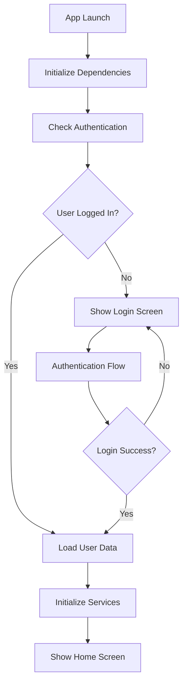
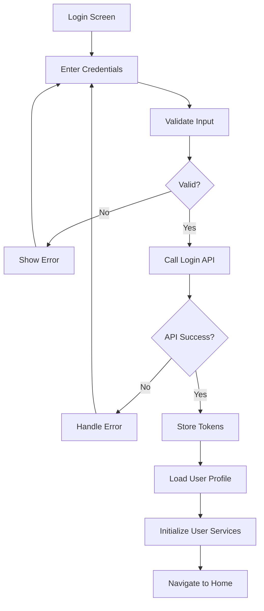
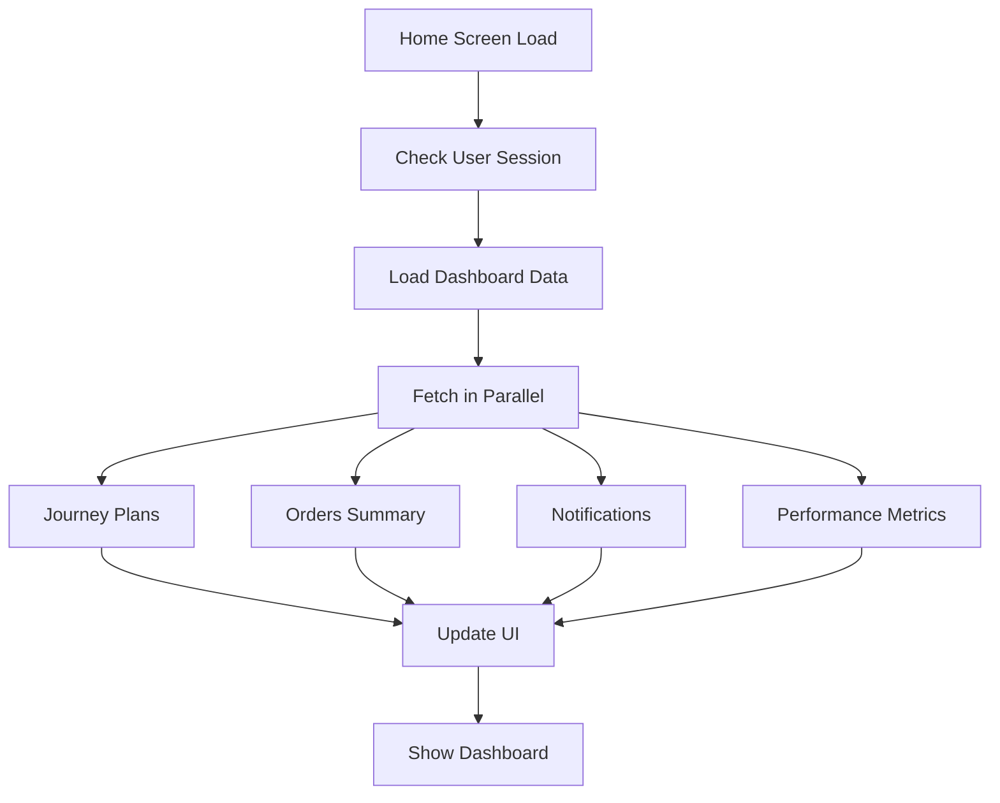
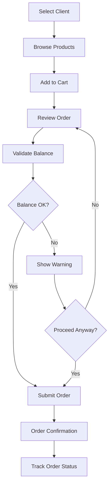

# Woosh Field Sales App - Clean Architecture Implementation
## Building a Modern Field Sales App from Scratch

### Executive Summary

This document outlines the complete implementation of **Woosh** - a modern, high-performance field sales application built from scratch using clean architecture principles, Flutter best practices, and NestJS backend. This greenfield approach allows for optimal performance, scalability, and maintainability.

**New Woosh App Specifications:**
- **App Name**: Woosh Field Sales
- **Version**: 1.0.0+1 (Fresh start)
- **Bundle ID (iOS)**: com.cit.woosh (Keep existing)
- **Package Name (Android)**: com.cit.wooshs (Keep existing)
- **Architecture**: Clean Architecture + Feature-based modules
- **Backend**: NestJS + TypeScript + PostgreSQL + Redis

---

## 🏗️ **Clean Architecture Overview**

### **Architecture Layers**

```
┌─────────────────────────────────────────┐
│              PRESENTATION               │
│  ┌─────────┐ ┌─────────┐ ┌─────────────┐│
│  │  Pages  │ │ Widgets │ │ Controllers ││
│  └─────────┘ └─────────┘ └─────────────┘│
└─────────────────┬───────────────────────┘
                  │
┌─────────────────┴───────────────────────┐
│               DOMAIN                    │
│  ┌─────────┐ ┌─────────┐ ┌─────────────┐│
│  │ Entities│ │Use Cases│ │ Repositories││
│  └─────────┘ └─────────┘ └─────────────┘│
└─────────────────┬───────────────────────┘
                  │
┌─────────────────┴───────────────────────┐
│                DATA                     │
│  ┌─────────┐ ┌─────────┐ ┌─────────────┐│
│  │ Models  │ │ Services│ │   Storage   ││
│  └─────────┘ └─────────┘ └─────────────┘│
└─────────────────────────────────────────┘
```

---

## 🛠️ **Optimal Tech Stack**

### **Frontend (Flutter)**
```yaml
# New Woosh Field Sales App Configuration
name: woosh
description: "Modern field sales management application built with clean architecture"
version: 1.0.0+1  # Starting fresh

# Existing Bundle IDs (Keep Current)
# iOS Bundle ID: com.cit.woosh
# Android Package: com.cit.wooshs
# Firebase Project: Not using Firebase

# Core Framework  
flutter: ^3.24.0
dart: ^3.6.0

# State Management (Choose ONE)
get: ^4.6.5                    # Current - Keep for migration ease
# OR riverpod: ^2.6.1         # Alternative - More testable
# OR bloc: ^8.1.0             # Alternative - Enterprise grade

# Network & API
dio: ^5.8.0                    # Replace http - Better features
retrofit: ^4.0.0               # Type-safe API client
json_annotation: ^4.8.0       # JSON serialization

# Local Storage
hive: ^2.2.3                   # Keep - Good performance
get_storage: ^2.1.1            # Keep - Simple key-value

# Location & Maps
geolocator: ^13.0.3           # Keep - Location services
google_maps_flutter: ^2.5.0   # Add - Better maps
geocoding: ^2.1.1             # Keep - Address conversion

# UI & Animations
flutter_animate: ^4.2.0       # Replace staggered_animations
cached_network_image: ^3.3.1  # Keep - Image caching
shimmer: ^3.0.0               # Keep - Loading states
pull_to_refresh: ^2.0.0       # Keep - Refresh functionality

# Utilities
connectivity_plus: ^6.1.4     # Keep - Network monitoring
permission_handler: ^11.0.1   # Keep - Permissions
package_info_plus: ^8.0.2     # Keep - App info
intl: ^0.20.2                 # Keep - Internationalization

# Development
flutter_lints: ^5.0.0         # Keep - Linting
build_runner: ^2.4.8          # Keep - Code generation

# Testing
mockito: ^5.4.0               # Add - Mocking for tests
flutter_test:                 # Keep - Testing framework
  sdk: flutter

# Firebase Integration
firebase_core: ^3.6.0         # Add - Firebase core
firebase_messaging: ^15.1.3   # Add - Push notifications
firebase_analytics: ^11.3.3   # Add - Analytics
firebase_crashlytics: ^4.1.3  # Add - Crash reporting

# Performance Monitoring
firebase_performance: ^0.10.0 # Add - Performance monitoring
sentry_flutter: ^8.9.0        # Add - Error tracking
```

### **Modern Woosh pubspec.yaml (Clean Implementation)**
```yaml
name: woosh
description: "Modern field sales management application built with clean architecture"
publish_to: 'none'

version: 1.0.0+1  # Starting fresh

environment:
  sdk: ">=3.6.0 <4.0.0"
  flutter: ">=3.24.0"

dependencies:
  flutter:
    sdk: flutter

  # Core Framework
  cupertino_icons: ^1.0.8
  
  # State Management & Navigation (Modern approach)
  get: ^4.6.5
  get_storage: ^2.1.1
  
  # Network & API (Type-safe, high-performance)
  dio: ^5.8.0
  retrofit: ^4.0.0
  json_annotation: ^4.8.0
  connectivity_plus: ^6.1.4
  
  # Local Storage & Offline (Optimized)
  hive: ^2.2.3
  hive_flutter: ^1.1.0
  path_provider: ^2.1.5
  sqflite: ^2.3.0                 # Local database for complex queries
  drift: ^2.14.0                  # Type-safe SQL with offline support
  
  # Location & Maps (Enhanced)
  geolocator: ^13.0.3
  geocoding: ^2.1.1
  google_maps_flutter: ^2.5.0
  
  # UI Components (Modern, performant)
  google_fonts: ^6.2.1
  flutter_svg: ^2.0.5
  cached_network_image: ^3.3.1
  shimmer: ^3.0.0
  pull_to_refresh: ^2.0.0
  flutter_animate: ^4.2.0
  percent_indicator: ^4.2.3
  lottie: ^3.1.0                  # Smooth animations
  
  # Utilities
  permission_handler: ^11.0.1
  intl: ^0.20.2
  image_picker: ^1.1.2
  file_picker: ^9.2.1
  url_launcher: ^6.2.5
  package_info_plus: ^8.0.2
  device_info_plus: ^10.1.0
  
  # Real-time & WebSocket
  socket_io_client: ^2.0.3
  
  # Performance & Monitoring
  sentry_flutter: ^8.9.0
  
  # Additional utilities
  crypto: ^3.0.3                  # Encryption
  uuid: ^4.5.0                    # Unique ID generation
  
  # Additional modern packages
  equatable: ^2.0.5               # Value equality
  dartz: ^0.10.1                  # Functional programming

dev_dependencies:
  flutter_test:
    sdk: flutter
  flutter_lints: ^5.0.0
  build_runner: ^2.4.8
  
  # Code generation
  hive_generator: ^2.0.1
  retrofit_generator: ^8.0.0
  json_serializable: ^6.7.0
  
  # Testing
  mockito: ^5.4.0
  bloc_test: ^9.1.0
  integration_test:
    sdk: flutter
  
  # Development tools
  flutter_launcher_icons: ^0.13.1
  flutter_native_splash: ^2.3.10

# Woosh splash screen (using existing gold theme)
flutter_native_splash:
  color: "#AE8625"  # goldStart color from existing theme
  image: assets/logos/woosh_logo.png
  android: true
  ios: true
  web: true
  android_gravity: center
  ios_content_mode: center
  fullscreen: true

# Woosh app icon (using existing gold theme)
flutter_launcher_icons:
  android: true
  ios: true
  image_path: "assets/icons/woosh_app_icon.png"
  min_sdk_android: 21
  remove_alpha_ios: true
  web:
    generate: true
    image_path: "assets/icons/woosh_app_icon.png"
    background_color: "#AE8625"  # goldStart color

flutter:
  uses-material-design: true
  
  assets:
    - assets/images/
    - assets/icons/
    - assets/logos/
    - assets/animations/
  
  fonts:
    - family: WooshSans
      fonts:
        - asset: assets/fonts/WooshSans-Regular.ttf
        - asset: assets/fonts/WooshSans-Medium.ttf
          weight: 500
        - asset: assets/fonts/WooshSans-SemiBold.ttf
          weight: 600
        - asset: assets/fonts/WooshSans-Bold.ttf
          weight: 700
```

### **Backend (NestJS - Recommended for Performance)**
```typescript
// API Server - NestJS (Your Current Choice - EXCELLENT!)
NestJS + TypeScript + Express/Fastify
// Performance: 40-60% faster than plain Express
// Benefits: Built-in DI, decorators, validation, swagger

// Alternative Backends (Performance Comparison)
Node.js + Express: Baseline performance
NestJS + Express: +40-50% faster (your choice ✅)
NestJS + Fastify: +60-80% faster (recommended upgrade)
Go + Gin: +200-300% faster (if considering rewrite)
Rust + Actix: +400-500% faster (if performance critical)

// Database Stack
PostgreSQL (Primary) - Excellent choice
Redis (Caching & Sessions) - Essential for performance
MongoDB (Optional) - For flexible data

// Real-time & Performance
WebSockets (NestJS Gateway + Socket.io) - Built-in support
Server-Sent Events - Simple real-time updates
Custom Push Notifications - Self-hosted solution

// Infrastructure
Docker + Kubernetes
PM2 (Node.js clustering)
Nginx (Load Balancer + Static Assets)
AWS/GCP/Azure Cloud (No Firebase dependency)
CDN (CloudFlare/AWS CloudFront)
```

---

## 📁 **Proposed Folder Structure**

### **Woosh Flutter App Structure (Clean Architecture)**

```
lib/
├── core/                          # Woosh core functionality
│   ├── constants/                 # App constants
│   │   ├── woosh_api_constants.dart
│   │   ├── woosh_storage_keys.dart
│   │   └── woosh_app_constants.dart
│   ├── errors/                    # Error handling
│   │   ├── exceptions.dart
│   │   ├── failures.dart
│   │   └── error_handler.dart
│   ├── network/                   # Network layer
│   │   ├── api_client.dart
│   │   ├── network_info.dart
│   │   └── interceptors/
│   │       ├── auth_interceptor.dart
│   │       ├── logging_interceptor.dart
│   │       └── error_interceptor.dart
│   ├── utils/                     # Utilities
│   │   ├── validators.dart
│   │   ├── formatters.dart
│   │   ├── extensions.dart
│   │   └── helpers.dart
│   ├── themes/                    # App theming
│   │   ├── app_theme.dart
│   │   ├── colors.dart
│   │   ├── text_styles.dart
│   │   └── dimensions.dart
│   └── security/                  # Security utilities
│       ├── encryption.dart
│       ├── token_manager.dart
│       └── secure_storage.dart
│
## 📊 **Field Reports System (Journey Plan Reports)**

### **Report Types & Implementation**

The Woosh app implements a comprehensive field reporting system with 5 report types integrated into journey plans:

#### **Required Reports (3/3 must be completed for checkout)**

**1. Product Availability Report** 📦
- **Purpose**: Track product stock levels at client locations
- **Data**: Product selection, quantity, availability status, comments
- **Validation**: Product must be selected, quantity required
- **Storage**: Offline-first with Hive + sync to server

**2. Visibility Activity Report** 📸  
- **Purpose**: Document marketing/promotional activities with photo evidence
- **Data**: Photos (camera integration), location tags, activity comments
- **Validation**: Photo OR comment required
- **Features**: Image compression, GPS tagging, upload progress

**3. Feedback Report** 💬
- **Purpose**: Collect client feedback and general observations
- **Data**: Text feedback, rating (optional), category classification
- **Validation**: Feedback text required
- **Storage**: Simple text-based submission

#### **Optional Reports**

**4. Product Return Report** ↩️
- **Purpose**: Process product returns from clients
- **Data**: Multiple products, quantities, return reasons, photo evidence
- **Features**: Cart-style interface, bulk return processing

**5. Product Sample Report** 🎁
- **Purpose**: Track product samples distributed to clients  
- **Data**: Sample products, quantities, distribution purpose
- **Features**: Multi-item selection, sample tracking

### **Visit Completion Logic**
```
Checkout Requirements:
✅ Product Availability Report (REQUIRED)
✅ Visibility Activity Report (REQUIRED)  
✅ Feedback Report (REQUIRED)
🟡 Product Return Report (OPTIONAL)
🟡 Product Sample Report (OPTIONAL)

Progress: 3/3 Required → Checkout Enabled
```

### **Report Architecture in Clean Structure**

```dart
// Domain Entities
abstract class Report {
  final String id;
  final String journeyPlanId;
  final String salesRepId;
  final String clientId;
  final DateTime createdAt;
  final ReportType type;
  final ReportStatus status;
}

enum ReportType {
  PRODUCT_AVAILABILITY,
  VISIBILITY_ACTIVITY, 
  FEEDBACK,
  PRODUCT_RETURN,
  PRODUCT_SAMPLE
}

enum ReportStatus {
  draft,
  submitted,
  synced,
  failed
}

// Use Cases
class SubmitReportUseCase {
  Future<Result<void>> execute(Report report);
}

class ValidateVisitCompletionUseCase {
  Future<Result<bool>> execute(String journeyPlanId);
}

// Repository Pattern
abstract class ReportsRepository {
  Future<void> submitReport(Report report);
  Future<List<Report>> getReportsForJourney(String journeyPlanId);
  Future<bool> areRequiredReportsComplete(String journeyPlanId);
  Future<void> syncPendingReports();
}
```

### **Offline-First Report Handling**
```dart
// Local Storage Strategy
class ReportsLocalDataSource {
  // Hive boxes for each report type
  Box<ProductAvailabilityReport> productAvailabilityBox;
  Box<VisibilityActivityReport> visibilityActivityBox;
  Box<FeedbackReport> feedbackBox;
  
  // Offline submission queue
  Box<PendingReportSync> pendingSyncBox;
  
  Future<void> saveReportOffline(Report report);
  Future<void> queueForSync(Report report);
  Future<List<Report>> getPendingSyncReports();
}

// Sync Service
class ReportSyncService {
  Future<void> syncAllPendingReports() async {
    final pendingReports = await localDataSource.getPendingSyncReports();
    for (final report in pendingReports) {
      try {
        await remoteDataSource.submitReport(report);
        await localDataSource.markAsSynced(report.id);
      } catch (e) {
        // Handle sync failure, retry later
        await localDataSource.markSyncFailed(report.id);
      }
    }
  }
}
```

---

├── features/                      # Woosh feature modules
│   ├── authentication/           # Authentication feature
│   │   ├── data/
│   │   │   ├── datasources/
│   │   │   │   ├── auth_remote_datasource.dart
│   │   │   │   └── auth_local_datasource.dart
│   │   │   ├── models/
│   │   │   │   ├── user_model.dart
│   │   │   │   ├── login_request_model.dart
│   │   │   │   ├── login_response_model.dart
│   │   │   │   └── token_model.dart
│   │   │   └── repositories/
│   │   │       └── auth_repository_impl.dart
│   │   ├── domain/
│   │   │   ├── entities/
│   │   │   │   ├── user.dart
│   │   │   │   └── session.dart
│   │   │   ├── repositories/
│   │   │   │   └── auth_repository.dart
│   │   │   └── usecases/
│   │   │       ├── login_usecase.dart
│   │   │       ├── logout_usecase.dart
│   │   │       ├── refresh_token_usecase.dart
│   │   │       ├── get_current_user_usecase.dart
│   │   │       └── reset_password_usecase.dart
│   │   └── presentation/
│   │       ├── controllers/
│   │       │   ├── auth_controller.dart
│   │       │   └── session_controller.dart
│   │       ├── pages/
│   │       │   ├── splash_page.dart
│   │       │   ├── login_page.dart
│   │       │   ├── signup_page.dart
│   │       │   └── forgot_password_page.dart
│   │       ├── widgets/
│   │       │   ├── login_form.dart
│   │       │   ├── auth_button.dart
│   │       │   ├── social_login_buttons.dart
│   │       │   └── biometric_auth_widget.dart
│   │       └── bindings/
│   │           └── auth_binding.dart
│   │
│   ├── orders/                   # Order management feature
│   │   ├── data/
│   │   │   ├── datasources/
│   │   │   │   ├── orders_remote_datasource.dart
│   │   │   │   └── orders_local_datasource.dart
│   │   │   ├── models/
│   │   │   │   ├── order_model.dart
│   │   │   │   ├── order_item_model.dart
│   │   │   │   ├── create_order_request_model.dart
│   │   │   │   └── order_status_model.dart
│   │   │   └── repositories/
│   │   │       └── orders_repository_impl.dart
│   │   ├── domain/
│   │   │   ├── entities/
│   │   │   │   ├── order.dart
│   │   │   │   ├── order_item.dart
│   │   │   │   └── order_status.dart
│   │   │   ├── repositories/
│   │   │   │   └── orders_repository.dart
│   │   │   └── usecases/
│   │   │       ├── create_order_usecase.dart
│   │   │       ├── get_orders_usecase.dart
│   │   │       ├── get_order_by_id_usecase.dart
│   │   │       ├── update_order_usecase.dart
│   │   │       ├── cancel_order_usecase.dart
│   │   │       └── validate_order_balance_usecase.dart
│   │   └── presentation/
│   │       ├── controllers/
│   │       │   ├── orders_controller.dart
│   │       │   ├── create_order_controller.dart
│   │       │   ├── order_detail_controller.dart
│   │       │   └── cart_controller.dart
│   │       ├── pages/
│   │       │   ├── orders_list_page.dart
│   │       │   ├── create_order_page.dart
│   │       │   ├── order_detail_page.dart
│   │       │   └── cart_page.dart
│   │       ├── widgets/
│   │       │   ├── order_card.dart
│   │       │   ├── order_status_badge.dart
│   │       │   ├── order_item_widget.dart
│   │       │   ├── balance_warning_widget.dart
│   │       │   └── order_timeline_widget.dart
│   │       └── bindings/
│   │           ├── orders_binding.dart
│   │           └── create_order_binding.dart
│   │
│   ├── clients/                  # Client management feature
│   │   ├── data/
│   │   │   ├── datasources/
│   │   │   │   ├── clients_remote_datasource.dart
│   │   │   │   └── clients_local_datasource.dart
│   │   │   ├── models/
│   │   │   │   ├── client_model.dart
│   │   │   │   ├── client_balance_model.dart
│   │   │   │   └── payment_model.dart
│   │   │   └── repositories/
│   │   │       └── clients_repository_impl.dart
│   │   ├── domain/
│   │   │   ├── entities/
│   │   │   │   ├── client.dart
│   │   │   │   ├── client_balance.dart
│   │   │   │   └── payment.dart
│   │   │   ├── repositories/
│   │   │   │   └── clients_repository.dart
│   │   │   └── usecases/
│   │   │       ├── get_clients_usecase.dart
│   │   │       ├── get_client_by_id_usecase.dart
│   │   │       ├── create_client_usecase.dart
│   │   │       ├── update_client_usecase.dart
│   │   │       ├── get_client_balance_usecase.dart
│   │   │       └── add_payment_usecase.dart
│   │   └── presentation/
│   │       ├── controllers/
│   │       │   ├── clients_controller.dart
│   │       │   ├── client_detail_controller.dart
│   │       │   └── add_payment_controller.dart
│   │       ├── pages/
│   │       │   ├── clients_list_page.dart
│   │       │   ├── client_detail_page.dart
│   │       │   ├── add_client_page.dart
│   │       │   └── add_payment_page.dart
│   │       ├── widgets/
│   │       │   ├── client_card.dart
│   │       │   ├── client_balance_widget.dart
│   │       │   ├── payment_history_widget.dart
│   │       │   └── client_location_widget.dart
│   │       └── bindings/
│   │           ├── clients_binding.dart
│   │           └── client_detail_binding.dart
│   │
│   ├── journey_plans/            # Journey planning feature
│   │   ├── data/
│   │   │   ├── datasources/
│   │   │   │   ├── journey_plans_remote_datasource.dart
│   │   │   │   └── journey_plans_local_datasource.dart
│   │   │   ├── models/
│   │   │   │   ├── journey_plan_model.dart
│   │   │   │   ├── route_model.dart
│   │   │   │   └── visit_model.dart
│   │   │   └── repositories/
│   │   │       └── journey_plans_repository_impl.dart
│   │   ├── domain/
│   │   │   ├── entities/
│   │   │   │   ├── journey_plan.dart
│   │   │   │   ├── route.dart
│   │   │   │   └── visit.dart
│   │   │   ├── repositories/
│   │   │   │   └── journey_plans_repository.dart
│   │   │   └── usecases/
│   │   │       ├── get_journey_plans_usecase.dart
│   │   │       ├── create_journey_plan_usecase.dart
│   │   │       ├── optimize_route_usecase.dart
│   │   │       ├── check_in_usecase.dart
│   │   │       ├── check_out_usecase.dart
│   │   │       └── validate_geofence_usecase.dart
│   │   └── presentation/
│   │       ├── controllers/
│   │       │   ├── journey_plans_controller.dart
│   │       │   ├── journey_detail_controller.dart
│   │       │   └── route_optimization_controller.dart
│   │       ├── pages/
│   │       │   ├── journey_plans_page.dart
│   │       │   ├── journey_detail_page.dart
│   │       │   ├── create_journey_plan_page.dart
│   │       │   └── route_map_page.dart
│   │       ├── widgets/
│   │       │   ├── journey_plan_card.dart
│   │       │   ├── route_map_widget.dart
│   │       │   ├── visit_status_widget.dart
│   │       │   ├── geofence_indicator.dart
│   │       │   └── check_in_button.dart
│   │       └── bindings/
│   │           ├── journey_plans_binding.dart
│   │           └── journey_detail_binding.dart
│   │
│   ├── dashboard/                # Analytics dashboard feature
│   │   ├── data/
│   │   │   ├── datasources/
│   │   │   │   ├── dashboard_remote_datasource.dart
│   │   │   │   └── dashboard_local_datasource.dart
│   │   │   ├── models/
│   │   │   │   ├── dashboard_model.dart
│   │   │   │   ├── performance_metrics_model.dart
│   │   │   │   └── sales_analytics_model.dart
│   │   │   └── repositories/
│   │   │       └── dashboard_repository_impl.dart
│   │   ├── domain/
│   │   │   ├── entities/
│   │   │   │   ├── dashboard_data.dart
│   │   │   │   ├── performance_metrics.dart
│   │   │   │   └── sales_analytics.dart
│   │   │   ├── repositories/
│   │   │   │   └── dashboard_repository.dart
│   │   │   └── usecases/
│   │   │       ├── get_dashboard_data_usecase.dart
│   │   │       ├── get_performance_metrics_usecase.dart
│   │   │       └── get_sales_analytics_usecase.dart
│   │   └── presentation/
│   │       ├── controllers/
│   │       │   ├── home_controller.dart
│   │       │   ├── dashboard_controller.dart
│   │       │   └── analytics_controller.dart
│   │       ├── pages/
│   │       │   ├── home_page.dart
│   │       │   ├── dashboard_page.dart
│   │       │   └── analytics_page.dart
│   │       ├── widgets/
│   │       │   ├── stats_card.dart
│   │       │   ├── performance_chart.dart
│   │       │   ├── sales_chart.dart
│   │       │   ├── quick_actions_grid.dart
│   │       │   └── recent_activities_list.dart
│   │       └── bindings/
│   │           ├── home_binding.dart
│   │           └── dashboard_binding.dart
│   │
│   ├── reports/                  # Reporting feature
│   │   ├── data/
│   │   │   ├── datasources/
│   │   │   │   ├── reports_remote_datasource.dart
│   │   │   │   └── reports_local_datasource.dart
│   │   │   ├── models/
│   │   │   │   ├── report_model.dart
│   │   │   │   ├── product_availability_report_model.dart
│   │   │   │   ├── visibility_activity_report_model.dart
│   │   │   │   ├── feedback_report_model.dart
│   │   │   │   ├── product_return_report_model.dart
│   │   │   │   ├── product_sample_report_model.dart
│   │   │   │   ├── daily_report_model.dart
│   │   │   │   └── custom_report_model.dart
│   │   │   └── repositories/
│   │   │       └── reports_repository_impl.dart
│   │   ├── domain/
│   │   │   ├── entities/
│   │   │   │   ├── report.dart
│   │   │   │   ├── product_availability_report.dart
│   │   │   │   ├── visibility_activity_report.dart
│   │   │   │   ├── feedback_report.dart
│   │   │   │   ├── product_return_report.dart
│   │   │   │   ├── product_sample_report.dart
│   │   │   │   ├── daily_report.dart
│   │   │   │   └── report_filter.dart
│   │   │   ├── repositories/
│   │   │   │   └── reports_repository.dart
│   │   │   └── usecases/
│   │   │       ├── submit_product_availability_usecase.dart
│   │   │       ├── submit_visibility_activity_usecase.dart
│   │   │       ├── submit_feedback_usecase.dart
│   │   │       ├── submit_product_return_usecase.dart
│   │   │       ├── submit_product_sample_usecase.dart
│   │   │       ├── get_reports_usecase.dart
│   │   │       ├── validate_visit_completion_usecase.dart
│   │   │       ├── generate_daily_report_usecase.dart
│   │   │       └── export_report_usecase.dart
│   │   └── presentation/
│   │       ├── controllers/
│   │       │   ├── reports_controller.dart
│   │       │   └── daily_report_controller.dart
│   │       ├── pages/
│   │       │   ├── reports_main_page.dart
│   │       │   ├── product_availability_page.dart
│   │       │   ├── visibility_activity_page.dart
│   │       │   ├── feedback_page.dart
│   │       │   ├── product_return_page.dart
│   │       │   ├── product_sample_page.dart
│   │       │   ├── daily_report_page.dart
│   │       │   └── report_detail_page.dart
│   │       ├── widgets/
│   │       │   ├── report_progress_indicator.dart
│   │       │   ├── report_type_button.dart
│   │       │   ├── product_selector_widget.dart
│   │       │   ├── image_capture_widget.dart
│   │       │   ├── report_submission_widget.dart
│   │       │   ├── visit_completion_widget.dart
│   │       │   ├── report_card.dart
│   │       │   ├── report_chart.dart
│   │       │   └── export_options_widget.dart
│   │       └── bindings/
│   │           └── reports_binding.dart
│   │
│   ├── products/                 # Product catalog feature
│   │   ├── data/
│   │   │   ├── datasources/
│   │   │   │   ├── products_remote_datasource.dart
│   │   │   │   └── products_local_datasource.dart
│   │   │   ├── models/
│   │   │   │   ├── product_model.dart
│   │   │   │   ├── category_model.dart
│   │   │   │   └── inventory_model.dart
│   │   │   └── repositories/
│   │   │       └── products_repository_impl.dart
│   │   ├── domain/
│   │   │   ├── entities/
│   │   │   │   ├── product.dart
│   │   │   │   ├── category.dart
│   │   │   │   └── inventory.dart
│   │   │   ├── repositories/
│   │   │   │   └── products_repository.dart
│   │   │   └── usecases/
│   │   │       ├── get_products_usecase.dart
│   │   │       ├── search_products_usecase.dart
│   │   │       ├── get_categories_usecase.dart
│   │   │       └── check_inventory_usecase.dart
│   │   └── presentation/
│   │       ├── controllers/
│   │       │   ├── products_controller.dart
│   │       │   └── product_search_controller.dart
│   │       ├── pages/
│   │       │   ├── products_page.dart
│   │       │   ├── product_detail_page.dart
│   │       │   └── product_search_page.dart
│   │       ├── widgets/
│   │       │   ├── product_card.dart
│   │       │   ├── product_grid.dart
│   │       │   ├── category_filter.dart
│   │       │   └── search_bar.dart
│   │       └── bindings/
│   │           └── products_binding.dart
│   │
│   ├── notifications/            # Local notifications feature
│   │   ├── data/
│   │   │   ├── datasources/
│   │   │   │   ├── notifications_remote_datasource.dart
│   │   │   │   └── notifications_local_datasource.dart
│   │   │   ├── models/
│   │   │   │   ├── notification_model.dart
│   │   │   │   └── local_notification_model.dart
│   │   │   └── repositories/
│   │   │       └── notifications_repository_impl.dart
│   │   ├── domain/
│   │   │   ├── entities/
│   │   │   │   ├── notification.dart
│   │   │   │   └── notification_settings.dart
│   │   │   ├── repositories/
│   │   │   │   └── notifications_repository.dart
│   │   │   └── usecases/
│   │   │       ├── get_notifications_usecase.dart
│   │   │       ├── mark_as_read_usecase.dart
│   │   │       ├── schedule_local_notification_usecase.dart
│   │   │       └── update_notification_settings_usecase.dart
│   │   └── presentation/
│   │       ├── controllers/
│   │       │   ├── notifications_controller.dart
│   │       │   └── notification_settings_controller.dart
│   │       ├── pages/
│   │       │   ├── notifications_page.dart
│   │       │   └── notification_settings_page.dart
│   │       ├── widgets/
│   │       │   ├── notification_card.dart
│   │       │   ├── notification_badge.dart
│   │       │   └── notification_settings_tile.dart
│   │       └── bindings/
│   │           └── notifications_binding.dart
│   │
│   └── settings/                 # App settings feature
│       ├── data/
│       │   ├── datasources/
│       │   │   └── settings_local_datasource.dart
│       │   ├── models/
│       │   │   └── app_settings_model.dart
│       │   └── repositories/
│       │       └── settings_repository_impl.dart
│       ├── domain/
│       │   ├── entities/
│       │   │   └── app_settings.dart
│       │   ├── repositories/
│       │   │   └── settings_repository.dart
│       │   └── usecases/
│       │       ├── get_settings_usecase.dart
│       │       ├── update_settings_usecase.dart
│       │       └── reset_settings_usecase.dart
│       └── presentation/
│           ├── controllers/
│           │   ├── settings_controller.dart
│           │   └── profile_controller.dart
│           ├── pages/
│           │   ├── settings_page.dart
│           │   ├── profile_page.dart
│           │   └── about_page.dart
│           ├── widgets/
│           │   ├── settings_tile.dart
│           │   ├── profile_avatar.dart
│           │   └── version_info.dart
│           └── bindings/
│               └── settings_binding.dart
│
├── shared/                       # Shared components
│   ├── widgets/                  # Reusable widgets
│   │   ├── buttons/
│   │   │   ├── primary_button.dart
│   │   │   ├── secondary_button.dart
│   │   │   ├── icon_button.dart
│   │   │   └── floating_action_button.dart
│   │   ├── forms/
│   │   │   ├── custom_text_field.dart
│   │   │   ├── dropdown_field.dart
│   │   │   ├── date_picker_field.dart
│   │   │   └── search_field.dart
│   │   ├── lists/
│   │   │   ├── paginated_list_view.dart
│   │   │   ├── infinite_scroll_list.dart
│   │   │   ├── grouped_list_view.dart
│   │   │   └── empty_state_widget.dart
│   │   ├── indicators/
│   │   │   ├── loading_indicator.dart
│   │   │   ├── progress_indicator.dart
│   │   │   ├── status_indicator.dart
│   │   │   ├── shimmer_loading.dart
│   │   │   ├── offline_indicator.dart
│   │   │   ├── sync_status_indicator.dart
│   │   │   └── connection_status_widget.dart
│   │   ├── navigation/
│   │   │   ├── app_bar.dart
│   │   │   ├── bottom_navigation.dart
│   │   │   ├── drawer.dart
│   │   │   └── tab_bar.dart
│   │   ├── dialogs/
│   │   │   ├── confirmation_dialog.dart
│   │   │   ├── info_dialog.dart
│   │   │   ├── error_dialog.dart
│   │   │   └── loading_dialog.dart
│   │   └── cards/
│   │       ├── info_card.dart
│   │       ├── stats_card.dart
│   │       ├── action_card.dart
│   │       └── summary_card.dart
│   ├── services/                 # Shared services
│   │   ├── storage_service.dart
│   │   ├── offline_storage_service.dart    # Hive + SQLite offline storage
│   │   ├── sync_service.dart              # Online/offline synchronization
│   │   ├── location_service.dart
│   │   ├── notification_service.dart      # Local notifications only
│   │   ├── connectivity_service.dart
│   │   ├── permission_service.dart
│   │   ├── file_service.dart
│   │   ├── analytics_service.dart         # Custom analytics (no Firebase)
│   │   ├── websocket_service.dart         # Socket.io for real-time
│   │   ├── encryption_service.dart        # Local encryption
│   │   └── offline_queue_service.dart     # Queue operations for sync
│   ├── models/                   # Shared models
│   │   ├── api_response.dart
│   │   ├── pagination.dart
│   │   ├── result.dart
│   │   ├── base_model.dart
│   │   └── error_model.dart
│   └── utils/                    # Shared utilities
│       ├── date_utils.dart
│       ├── currency_utils.dart
│       ├── image_utils.dart
│       ├── permission_utils.dart
│       └── performance_utils.dart
│
├── config/                       # App configuration
│   ├── app_config.dart
│   ├── environment.dart
│   ├── dependency_injection.dart
│   └── routes/
│       ├── app_routes.dart
│       ├── route_middleware.dart
│       └── navigation_service.dart
│
└── main.dart                     # App entry point

# Platform-specific configuration files:
android/
├── app/
│   ├── build.gradle              # Android package: com.cit.wooshs (existing)
│   └── proguard-rules.pro       # Code obfuscation rules
├── gradle.properties
├── local.properties
└── key.properties               # Existing keystore configuration

ios/
├── Runner/
│   ├── Info.plist               # iOS Bundle ID: com.cit.woosh (existing)
│   └── Runner.entitlements      # iOS capabilities
├── Runner.xcodeproj/
└── Runner.xcworkspace/

# Assets structure:
assets/
├── images/
│   ├── logos/
│   │   ├── woosh_logo.png
│   │   ├── woosh_logo_dark.png
│   │   └── woosh_icon.png
│   ├── illustrations/
│   │   ├── empty_state.svg
│   │   ├── error_state.svg
│   │   └── success_state.svg
│   └── placeholders/
│       ├── user_placeholder.png
│       └── image_placeholder.png
├── icons/
│   ├── app_icon.png
│   ├── notification_icon.png
│   └── custom_icons/
├── animations/
│   ├── loading.json
│   ├── success.json
│   └── error.json
└── fonts/
    ├── WooshSans-Regular.ttf
    ├── WooshSans-Medium.ttf
    ├── WooshSans-SemiBold.ttf
    └── WooshSans-Bold.ttf
```

---

## 📱 **Offline-First Architecture**

### **Offline Strategy Overview**
```
Online Mode:
- Real-time data sync
- Live order tracking  
- Instant updates

Offline Mode:
- Local data access
- Queue operations
- Background sync when online
- Critical features work offline

Hybrid Mode:
- Smart caching
- Partial sync
- Conflict resolution
```

### **Offline Storage Architecture**
```dart
// lib/shared/services/offline_storage_service.dart
class OfflineStorageService extends GetxService {
  late Box<WooshUser> _userBox;
  late Box<WooshOrder> _ordersBox;
  late Box<WooshClient> _clientsBox;
  late Box<WooshProduct> _productsBox;
  late Box<WooshJourneyPlan> _journeyPlansBox;
  late Box<WooshOfflineOperation> _offlineOperationsBox;
  
  @override
  Future<void> onInit() async {
    super.onInit();
    await _initializeBoxes();
  }
  
  Future<void> _initializeBoxes() async {
    await Hive.initFlutter();
    
    // Register adapters
    Hive.registerAdapter(WooshUserAdapter());
    Hive.registerAdapter(WooshOrderAdapter());
    Hive.registerAdapter(WooshClientAdapter());
    Hive.registerAdapter(WooshProductAdapter());
    Hive.registerAdapter(WooshJourneyPlanAdapter());
    Hive.registerAdapter(WooshOfflineOperationAdapter());
    
    // Open boxes
    _userBox = await Hive.openBox<WooshUser>('woosh_users');
    _ordersBox = await Hive.openBox<WooshOrder>('woosh_orders');
    _clientsBox = await Hive.openBox<WooshClient>('woosh_clients');
    _productsBox = await Hive.openBox<WooshProduct>('woosh_products');
    _journeyPlansBox = await Hive.openBox<WooshJourneyPlan>('woosh_journey_plans');
    _offlineOperationsBox = await Hive.openBox<WooshOfflineOperation>('woosh_offline_ops');
  }
  
  // Offline CRUD operations
  Future<void> saveOrder(WooshOrder order) async {
    await _ordersBox.put(order.id, order);
  }
  
  Future<WooshOrder?> getOrder(String orderId) async {
    return _ordersBox.get(orderId);
  }
  
  Future<List<WooshOrder>> getAllOrders() async {
    return _ordersBox.values.toList();
  }
  
  Future<void> saveClient(WooshClient client) async {
    await _clientsBox.put(client.id, client);
  }
  
  Future<List<WooshClient>> getAllClients() async {
    return _clientsBox.values.toList();
  }
  
  Future<List<WooshProduct>> getAllProducts() async {
    return _productsBox.values.toList();
  }
  
  // Offline operations queue
  Future<void> queueOperation(WooshOfflineOperation operation) async {
    await _offlineOperationsBox.put(operation.id, operation);
  }
  
  Future<List<WooshOfflineOperation>> getPendingOperations() async {
    return _offlineOperationsBox.values.toList();
  }
  
  Future<void> removeOperation(String operationId) async {
    await _offlineOperationsBox.delete(operationId);
  }
}

// lib/shared/services/sync_service.dart
class WooshSyncService extends GetxService {
  final OfflineStorageService _offlineStorage;
  final ConnectivityService _connectivity;
  final WooshApiClient _apiClient;
  
  final _isSyncing = false.obs;
  final _lastSyncTime = Rxn<DateTime>();
  final _pendingOperationsCount = 0.obs;
  
  Timer? _syncTimer;
  
  WooshSyncService(this._offlineStorage, this._connectivity, this._apiClient);
  
  @override
  Future<void> onInit() async {
    super.onInit();
    _startConnectivityMonitoring();
    _startPeriodicSync();
  }
  
  void _startConnectivityMonitoring() {
    _connectivity.onConnectivityChanged.listen((isConnected) {
      if (isConnected && !_isSyncing.value) {
        _syncPendingOperations();
      }
    });
  }
  
  void _startPeriodicSync() {
    _syncTimer = Timer.periodic(Duration(minutes: 5), (_) {
      if (_connectivity.isConnected && !_isSyncing.value) {
        _syncPendingOperations();
      }
    });
  }
  
  Future<void> _syncPendingOperations() async {
    if (_isSyncing.value) return;
    
    _isSyncing.value = true;
    
    try {
      final pendingOperations = await _offlineStorage.getPendingOperations();
      _pendingOperationsCount.value = pendingOperations.length;
      
      for (final operation in pendingOperations) {
        try {
          await _executeOperation(operation);
          await _offlineStorage.removeOperation(operation.id);
        } catch (e) {
          print('Failed to sync operation ${operation.id}: $e');
          // Keep in queue for retry
        }
      }
      
      _lastSyncTime.value = DateTime.now();
      _pendingOperationsCount.value = 0;
      
    } catch (e) {
      print('Sync failed: $e');
    } finally {
      _isSyncing.value = false;
    }
  }
  
  Future<void> _executeOperation(WooshOfflineOperation operation) async {
    switch (operation.type) {
      case OfflineOperationType.createOrder:
        await _apiClient.createOrder(operation.data);
        break;
      case OfflineOperationType.updateOrder:
        await _apiClient.updateOrder(operation.data['id'], operation.data);
        break;
      case OfflineOperationType.checkIn:
        await _apiClient.checkIn(operation.data);
        break;
      case OfflineOperationType.checkOut:
        await _apiClient.checkOut(operation.data);
        break;
      case OfflineOperationType.addPayment:
        await _apiClient.addPayment(operation.data);
        break;
    }
  }
}

// lib/shared/models/offline_operation.dart
@HiveType(typeId: 10)
class WooshOfflineOperation {
  @HiveField(0)
  final String id;
  
  @HiveField(1)
  final OfflineOperationType type;
  
  @HiveField(2)
  final Map<String, dynamic> data;
  
  @HiveField(3)
  final DateTime createdAt;
  
  @HiveField(4)
  final int retryCount;
  
  WooshOfflineOperation({
    required this.id,
    required this.type,
    required this.data,
    required this.createdAt,
    this.retryCount = 0,
  });
}

@HiveType(typeId: 11)
enum OfflineOperationType {
  @HiveField(0)
  createOrder,
  
  @HiveField(1)
  updateOrder,
  
  @HiveField(2)
  checkIn,
  
  @HiveField(3)
  checkOut,
  
  @HiveField(4)
  addPayment,
  
  @HiveField(5)
  createClient,
  
  @HiveField(6)
  updateClient,
}
```

### **Offline-First Repository Pattern**
```dart
// lib/features/orders/data/repositories/orders_repository_impl.dart
class OrdersRepositoryImpl implements OrdersRepository {
  final OrdersRemoteDataSource _remoteDataSource;
  final OrdersLocalDataSource _localDataSource;
  final ConnectivityService _connectivity;
  final WooshSyncService _syncService;
  
  OrdersRepositoryImpl({
    required OrdersRemoteDataSource remoteDataSource,
    required OrdersLocalDataSource localDataSource,
    required ConnectivityService connectivity,
    required WooshSyncService syncService,
  }) : _remoteDataSource = remoteDataSource,
       _localDataSource = localDataSource,
       _connectivity = connectivity,
       _syncService = syncService;
  
  @override
  Future<Either<WooshFailure, List<WooshOrder>>> getOrders({
    WooshOrderStatus? status,
    DateTime? startDate,
    DateTime? endDate,
  }) async {
    try {
      // Always return local data first for instant UI
      final localOrders = await _localDataSource.getOrders(
        status: status,
        startDate: startDate,
        endDate: endDate,
      );
      
      // If online, fetch fresh data and update local storage
      if (await _connectivity.isConnected) {
        try {
          final remoteOrders = await _remoteDataSource.getOrders(
            status: status,
            startDate: startDate,
            endDate: endDate,
          );
          
          // Update local storage with fresh data
          await _localDataSource.saveOrders(remoteOrders);
          
          return Right(remoteOrders);
        } catch (e) {
          // If remote fails, return local data
          return Right(localOrders);
        }
      }
      
      // Return local data when offline
      return Right(localOrders);
      
    } catch (e) {
      return Left(WooshCacheFailure('Failed to get orders: ${e.toString()}'));
    }
  }
  
  @override
  Future<Either<WooshFailure, WooshOrder>> createOrder(CreateOrderParams params) async {
    try {
      // Create order locally first for instant feedback
      final localOrder = WooshOrder(
        id: const Uuid().v4(),
        clientId: params.clientId,
        items: params.items,
        totalAmount: params.totalAmount,
        status: WooshOrderStatus.draft,
        createdAt: DateTime.now(),
        createdBy: params.userId,
        isOfflineCreated: true,
      );
      
      // Save locally immediately
      await _localDataSource.saveOrder(localOrder);
      
      // If online, try to sync immediately
      if (await _connectivity.isConnected) {
        try {
          final remoteOrder = await _remoteDataSource.createOrder(params);
          
          // Update local order with server response
          final updatedOrder = localOrder.copyWith(
            id: remoteOrder.id,
            status: remoteOrder.status,
            isOfflineCreated: false,
          );
          
          await _localDataSource.saveOrder(updatedOrder);
          return Right(updatedOrder);
          
        } catch (e) {
          // Queue for later sync
          await _syncService.queueOperation(WooshOfflineOperation(
            id: const Uuid().v4(),
            type: OfflineOperationType.createOrder,
            data: params.toJson(),
            createdAt: DateTime.now(),
          ));
          
          return Right(localOrder);
        }
      } else {
        // Queue for sync when online
        await _syncService.queueOperation(WooshOfflineOperation(
          id: const Uuid().v4(),
          type: OfflineOperationType.createOrder,
          data: params.toJson(),
          createdAt: DateTime.now(),
        ));
        
        return Right(localOrder);
      }
      
    } catch (e) {
      return Left(WooshServerFailure('Failed to create order: ${e.toString()}'));
    }
  }
}
```

---

## 🔄 **Complete Process Flow Architecture**

### **1. Application Startup Flow**



#### **Startup Implementation**
```dart
// lib/main.dart - Woosh App Entry Point
void main() async {
  WidgetsFlutterBinding.ensureInitialized();
  
  // Initialize Woosh core dependencies
  await WooshDependencyInjection.init();
  
  // Initialize Woosh storage
  await WooshStorageService.init();
  
  // Check Woosh authentication state
  final authController = Get.find<WooshAuthController>();
  await authController.checkAuthStatus();
  
        runApp(WooshApp());
    }
    
    class WooshApp extends StatelessWidget {
      @override
      Widget build(BuildContext context) {
        return GetMaterialApp(
          title: 'Woosh Field Sales',
          theme: WooshTheme.lightTheme,
          darkTheme: WooshTheme.darkTheme,
          initialRoute: WooshRoutes.splash,
          getPages: WooshRoutes.routes,
          debugShowCheckedModeBanner: false,
          // App configuration
          defaultTransition: Transition.cupertino,
          transitionDuration: Duration(milliseconds: 300),
          // Localization ready
          locale: Get.deviceLocale,
          fallbackLocale: Locale('en', 'US'),
          // Custom error handling
          unknownRoute: WooshRoutes.notFound,
          // Performance optimization
          smartManagement: SmartManagement.keepFactory,
        );
      }
    }

// lib/config/woosh_dependency_injection.dart
class WooshDependencyInjection {
  static Future<void> init() async {
    // Woosh core services
    Get.put<WooshNetworkInfo>(WooshNetworkInfoImpl());
    Get.put<WooshStorageService>(WooshStorageServiceImpl());
    
    // Woosh feature dependencies
    _initWooshAuthDependencies();
    _initWooshOrderDependencies();
    _initWooshClientDependencies();
    _initWooshJourneyPlanDependencies();
    _initWooshDashboardDependencies();
  }
  
  static void _initWooshAuthDependencies() {
    // Woosh authentication module setup
    Get.lazyPut<WooshAuthRepository>(() => WooshAuthRepositoryImpl());
    Get.lazyPut<WooshLoginUsecase>(() => WooshLoginUsecase(Get.find()));
    Get.put<WooshAuthController>(WooshAuthController(Get.find()));
  }
}
```

### **2. Authentication Flow**



#### **Authentication Implementation**
```dart
// lib/features/authentication/domain/usecases/login_usecase.dart
class LoginUsecase {
  final AuthRepository repository;
  
  LoginUsecase(this.repository);
  
  Future<Either<Failure, User>> call(LoginParams params) async {
    // Validate input
    final validation = _validateCredentials(params);
    if (validation.isLeft()) return validation;
    
    // Attempt login
    return await repository.login(params.email, params.password);
  }
}

// lib/features/authentication/presentation/controllers/auth_controller.dart
class AuthController extends GetxController {
  final LoginUsecase _loginUsecase;
  final LogoutUsecase _logoutUsecase;
  
  final _isLoading = false.obs;
  final _user = Rxn<User>();
  
  Future<void> login(String email, String password) async {
    _isLoading.value = true;
    
    final result = await _loginUsecase(
      LoginParams(email: email, password: password)
    );
    
    result.fold(
      (failure) => _handleLoginError(failure),
      (user) => _handleLoginSuccess(user),
    );
    
    _isLoading.value = false;
  }
}
```

### **3. Home Dashboard Flow**



#### **Dashboard Implementation**
```dart
// lib/features/dashboard/presentation/controllers/dashboard_controller.dart
class DashboardController extends GetxController {
  final GetDashboardDataUsecase _getDashboardData;
  
  final _isLoading = false.obs;
  final _dashboardData = Rxn<DashboardData>();
  
  @override
  void onInit() {
    super.onInit();
    loadDashboard();
  }
  
  Future<void> loadDashboard() async {
    _isLoading.value = true;
    
    final result = await _getDashboardData(NoParams());
    
    result.fold(
      (failure) => _handleError(failure),
      (data) => _dashboardData.value = data,
    );
    
    _isLoading.value = false;
  }
}
```

### **4. Order Management Flow**



#### **Order Flow Implementation**
```dart
// lib/features/orders/domain/usecases/create_order_usecase.dart
class CreateOrderUsecase {
  final OrderRepository repository;
  final ValidateBalanceUsecase validateBalance;
  
  Future<Either<Failure, Order>> call(CreateOrderParams params) async {
    // Validate balance first
    final balanceValidation = await validateBalance(
      ValidateBalanceParams(
        clientId: params.clientId,
        amount: params.totalAmount,
      )
    );
    
    return balanceValidation.fold(
      (failure) => Left(failure),
      (isValid) => isValid 
          ? repository.createOrder(params)
          : Left(InsufficientBalanceFailure()),
    );
  }
}
```

---

## 🎯 **Feature Module Structure**

### **Authentication Module**

#### **Domain Layer**
```dart
// lib/features/authentication/domain/entities/user.dart
class User extends Equatable {
  final String id;
  final String name;
  final String email;
  final String phoneNumber;
  final UserRole role;
  final String? profileImage;
  
  const User({
    required this.id,
    required this.name,
    required this.email,
    required this.phoneNumber,
    required this.role,
    this.profileImage,
  });
  
  @override
  List<Object?> get props => [id, name, email, phoneNumber, role];
}

// lib/features/authentication/domain/repositories/auth_repository.dart
abstract class AuthRepository {
  Future<Either<Failure, User>> login(String email, String password);
  Future<Either<Failure, void>> logout();
  Future<Either<Failure, String>> refreshToken();
  Future<Either<Failure, User>> getCurrentUser();
}
```

#### **Data Layer**
```dart
// lib/features/authentication/data/models/user_model.dart
@JsonSerializable()
class UserModel extends User {
  const UserModel({
    required super.id,
    required super.name,
    required super.email,
    required super.phoneNumber,
    required super.role,
    super.profileImage,
  });
  
  factory UserModel.fromJson(Map<String, dynamic> json) => 
      _$UserModelFromJson(json);
  
  Map<String, dynamic> toJson() => _$UserModelToJson(this);
}

// lib/features/authentication/data/datasources/auth_remote_datasource.dart
abstract class AuthRemoteDataSource {
  Future<UserModel> login(String email, String password);
  Future<void> logout();
  Future<String> refreshToken();
}

@RestApi()
abstract class AuthApiClient {
  factory AuthApiClient(Dio dio) = _AuthApiClient;
  
  @POST('/auth/login')
  Future<ApiResponse<UserModel>> login(@Body() LoginRequest request);
  
  @POST('/auth/logout')
  Future<ApiResponse<void>> logout();
  
  @POST('/auth/refresh')
  Future<ApiResponse<TokenResponse>> refreshToken();
}
```

#### **Presentation Layer**
```dart
// lib/features/authentication/presentation/pages/login_page.dart
class LoginPage extends GetView<AuthController> {
  @override
  Widget build(BuildContext context) {
    return Scaffold(
      body: SafeArea(
        child: Padding(
          padding: EdgeInsets.all(24),
          child: Column(
            children: [
              _buildLogo(),
              SizedBox(height: 48),
              _buildLoginForm(),
              SizedBox(height: 24),
              _buildLoginButton(),
              _buildSignupLink(),
            ],
          ),
        ),
      ),
    );
  }
  
  Widget _buildLoginButton() {
    return Obx(() => WooshPrimaryButton(
      text: 'Login',
      isLoading: controller.isLoading.value,
      onPressed: controller.isLoading.value ? null : _handleLogin,
    ));
  }
}
```

---

## 🛒 **Order Management Architecture**

### **Order Entity & Models**
```dart
// lib/features/orders/domain/entities/order.dart
class Order extends Equatable {
  final String id;
  final String clientId;
  final List<OrderItem> items;
  final double totalAmount;
  final OrderStatus status;
  final DateTime createdAt;
  final DateTime? deliveryDate;
  
  const Order({
    required this.id,
    required this.clientId,
    required this.items,
    required this.totalAmount,
    required this.status,
    required this.createdAt,
    this.deliveryDate,
  });
  
  @override
  List<Object?> get props => [id, clientId, items, totalAmount, status];
}

enum OrderStatus {
  draft,
  pending,
  approved,
  rejected,
  processing,
  delivered,
  cancelled,
}
```

### **Order Use Cases**
```dart
// lib/features/orders/domain/usecases/create_order_usecase.dart
class CreateOrderUsecase {
  final OrderRepository repository;
  final ValidateOrderUsecase validateOrder;
  
  CreateOrderUsecase({
    required this.repository,
    required this.validateOrder,
  });
  
  Future<Either<Failure, Order>> call(CreateOrderParams params) async {
    // Validate order
    final validation = await validateOrder(ValidateOrderParams(
      clientId: params.clientId,
      items: params.items,
      totalAmount: params.totalAmount,
    ));
    
    return validation.fold(
      (failure) => Left(failure),
      (isValid) => isValid 
          ? repository.createOrder(params)
          : Left(ValidationFailure('Order validation failed')),
    );
  }
}
```

---

## 🧭 **Navigation Architecture**

### **Route Management**
```dart
// lib/config/routes/woosh_routes.dart
class WooshRoutes {
  // Woosh app route names
  static const String splash = '/splash';
  static const String login = '/login';
  static const String home = '/home';
  static const String orders = '/orders';
  static const String orderDetail = '/orders/:orderId';
  static const String clients = '/clients';
  static const String clientDetail = '/clients/:clientId';
  static const String journeyPlans = '/journey-plans';
  static const String reports = '/reports';
  static const String profile = '/profile';
  static const String settings = '/settings';
  
  // Woosh route pages
  static final routes = [
    GetPage(
      name: splash,
      page: () => const WooshSplashPage(),
      transition: Transition.fadeIn,
    ),
    GetPage(
      name: login,
      page: () => const WooshLoginPage(),
      binding: WooshAuthBinding(),
      transition: Transition.fadeIn,
    ),
    GetPage(
      name: home,
      page: () => const WooshHomePage(),
      binding: WooshHomeBinding(),
      middlewares: [WooshAuthMiddleware()],
    ),
    GetPage(
      name: orders,
      page: () => const OrdersPage(),
      binding: OrdersBinding(),
      middlewares: [AuthMiddleware()],
    ),
    GetPage(
      name: orderDetail,
      page: () => OrderDetailPage(),
      binding: OrderDetailBinding(),
      middlewares: [AuthMiddleware()],
    ),
    // ... other routes
  ];
}

// lib/config/routes/auth_middleware.dart
class AuthMiddleware extends GetMiddleware {
  @override
  RouteSettings? redirect(String? route) {
    final authController = Get.find<AuthController>();
    
    if (!authController.isLoggedIn.value) {
      return const RouteSettings(name: AppRoutes.login);
    }
    
    return null;
  }
}
```

### **Navigation Service**
```dart
// lib/core/navigation/woosh_navigation_service.dart
class WooshNavigationService {
  static void toSplash() => Get.offAllNamed(WooshRoutes.splash);
  static void toLogin() => Get.offAllNamed(WooshRoutes.login);
  static void toHome() => Get.offAllNamed(WooshRoutes.home);
  static void toOrders() => Get.toNamed(WooshRoutes.orders);
  static void toOrderDetail(String orderId) => 
      Get.toNamed(WooshRoutes.orderDetail.replaceAll(':orderId', orderId));
  static void toClientDetail(String clientId) => 
      Get.toNamed(WooshRoutes.clientDetail.replaceAll(':clientId', clientId));
  
  static void back() => Get.back();
  static void backUntil(String routeName) => Get.until((route) => route.settings.name == routeName);
}
```

---

## 🗄️ **Data Management Architecture**

### **Repository Pattern**
```dart
// lib/features/orders/domain/repositories/order_repository.dart
abstract class OrderRepository {
  Future<Either<Failure, List<Order>>> getOrders({
    OrderStatus? status,
    DateTime? startDate,
    DateTime? endDate,
    int? limit,
    int? offset,
  });
  
  Future<Either<Failure, Order>> getOrderById(String orderId);
  Future<Either<Failure, Order>> createOrder(CreateOrderParams params);
  Future<Either<Failure, Order>> updateOrder(String orderId, UpdateOrderParams params);
  Future<Either<Failure, void>> deleteOrder(String orderId);
}

// lib/features/orders/data/repositories/order_repository_impl.dart
class OrderRepositoryImpl implements OrderRepository {
  final OrderRemoteDataSource remoteDataSource;
  final OrderLocalDataSource localDataSource;
  final NetworkInfo networkInfo;
  
  OrderRepositoryImpl({
    required this.remoteDataSource,
    required this.localDataSource,
    required this.networkInfo,
  });
  
  @override
  Future<Either<Failure, List<Order>>> getOrders({
    OrderStatus? status,
    DateTime? startDate,
    DateTime? endDate,
    int? limit,
    int? offset,
  }) async {
    if (await networkInfo.isConnected) {
      try {
        final orders = await remoteDataSource.getOrders(
          status: status,
          startDate: startDate,
          endDate: endDate,
          limit: limit,
          offset: offset,
        );
        
        // Cache for offline use
        await localDataSource.cacheOrders(orders);
        
        return Right(orders);
      } catch (e) {
        return Left(ServerFailure(e.toString()));
      }
    } else {
      // Return cached data when offline
      final cachedOrders = await localDataSource.getCachedOrders();
      return Right(cachedOrders);
    }
  }
}
```

---

## 🎨 **UI Architecture & Best Practices**

### **Woosh Widget Organization (Using Existing Gold Gradient)**
```dart
// lib/shared/widgets/buttons/woosh_primary_button.dart
class WooshPrimaryButton extends StatelessWidget {
  final String text;
  final VoidCallback? onPressed;
  final bool isLoading;
  final WooshButtonSize size;
  
  const WooshPrimaryButton({
    Key? key,
    required this.text,
    this.onPressed,
    this.isLoading = false,
    this.size = WooshButtonSize.medium,
  }) : super(key: key);

  @override
  Widget build(BuildContext context) {
    return Container(
      width: double.infinity,
      height: size.height,
      decoration: WooshGradientDecoration.goldBox(borderRadius: 12.0),
      child: Material(
        color: Colors.transparent,
        child: InkWell(
          onTap: isLoading ? null : onPressed,
          borderRadius: BorderRadius.circular(12),
          child: Container(
            alignment: Alignment.center,
            child: isLoading 
                ? SizedBox(
                    width: 20,
                    height: 20,
                    child: CircularProgressIndicator(
                      strokeWidth: 2,
                      valueColor: AlwaysStoppedAnimation<Color>(Colors.white),
                    ),
                  )
                : Text(
                    text,
                    style: TextStyle(
                      fontSize: size.fontSize,
                      fontWeight: FontWeight.w600,
                      color: Colors.white,
                    ),
                  ),
          ),
        ),
      ),
    );
  }
}

enum WooshButtonSize {
  small(height: 40, fontSize: 14),
  medium(height: 48, fontSize: 16),
  large(height: 56, fontSize: 18);

  const WooshButtonSize({required this.height, required this.fontSize});
  
  final double height;
  final double fontSize;
}

// lib/shared/widgets/forms/woosh_text_field.dart
class WooshTextField extends StatelessWidget {
  final String label;
  final String? hint;
  final TextEditingController? controller;
  final String? Function(String?)? validator;
  final TextInputType keyboardType;
  final bool obscureText;
  final Widget? prefixIcon;
  final Widget? suffixIcon;
  
  const WooshTextField({
    Key? key,
    required this.label,
    this.hint,
    this.controller,
    this.validator,
    this.keyboardType = TextInputType.text,
    this.obscureText = false,
    this.prefixIcon,
    this.suffixIcon,
  }) : super(key: key);
  
  @override
  Widget build(BuildContext context) {
    return Column(
      crossAxisAlignment: CrossAxisAlignment.start,
      children: [
        Text(label, style: Theme.of(context).textTheme.labelMedium),
        SizedBox(height: 8),
        TextFormField(
          controller: controller,
          validator: validator,
          keyboardType: keyboardType,
          obscureText: obscureText,
          decoration: InputDecoration(
            hintText: hint,
            prefixIcon: prefixIcon,
            suffixIcon: suffixIcon,
            border: _inputBorder(),
            focusedBorder: _focusedBorder(),
            errorBorder: _errorBorder(),
          ),
        ),
      ],
    );
  }
}
```

### **State Management Best Practices**
```dart
// lib/features/orders/presentation/controllers/orders_controller.dart
class OrdersController extends GetxController with StateMixin<List<Order>> {
  final GetOrdersUsecase _getOrders;
  final CreateOrderUsecase _createOrder;
  
  final _selectedStatus = Rxn<OrderStatus>();
  final _searchQuery = ''.obs;
  
  // Computed properties
  List<Order> get filteredOrders {
    var orders = state ?? <Order>[];
    
    if (_selectedStatus.value != null) {
      orders = orders.where((order) => order.status == _selectedStatus.value).toList();
    }
    
    if (_searchQuery.value.isNotEmpty) {
      orders = orders.where((order) => 
          order.client.name.toLowerCase().contains(_searchQuery.value.toLowerCase())
      ).toList();
    }
    
    return orders;
  }
  
  @override
  void onInit() {
    super.onInit();
    loadOrders();
  }
  
  Future<void> loadOrders() async {
    change(null, status: RxStatus.loading());
    
    final result = await _getOrders(GetOrdersParams());
    
    result.fold(
      (failure) => change(null, status: RxStatus.error(failure.message)),
      (orders) => change(orders, status: RxStatus.success()),
    );
  }
}
```

---

## 🌐 **API Architecture**

### **Retrofit API Client**
```dart
// lib/core/network/api_client.dart
@RestApi()
abstract class ApiClient {
  factory ApiClient(Dio dio) = _ApiClient;
  
  // Authentication
  @POST('/auth/login')
  Future<ApiResponse<LoginResponse>> login(@Body() LoginRequest request);
  
  @POST('/auth/logout')
  Future<ApiResponse<void>> logout();
  
  // Orders
  @GET('/orders')
  Future<ApiResponse<PaginatedResponse<OrderModel>>> getOrders(
    @Query('status') String? status,
    @Query('start_date') String? startDate,
    @Query('end_date') String? endDate,
    @Query('limit') int? limit,
    @Query('offset') int? offset,
  );
  
  @POST('/orders')
  Future<ApiResponse<OrderModel>> createOrder(@Body() CreateOrderRequest request);
  
  @GET('/orders/{orderId}')
  Future<ApiResponse<OrderModel>> getOrderById(@Path() String orderId);
  
  // Clients
  @GET('/clients')
  Future<ApiResponse<PaginatedResponse<ClientModel>>> getClients(
    @Query('search') String? search,
    @Query('region') String? region,
  );
  
  // Dashboard
  @GET('/dashboard/{userId}')
  Future<ApiResponse<DashboardModel>> getDashboard(
    @Path() String userId,
    @Query('period') String period,
  );
}

// lib/core/network/dio_client.dart
class DioClient {
  late Dio _dio;
  
  DioClient() {
    _dio = Dio(BaseOptions(
      baseUrl: AppConfig.baseUrl,
      connectTimeout: Duration(seconds: 30),
      receiveTimeout: Duration(seconds: 30),
      headers: {
        'Content-Type': 'application/json',
        'Accept': 'application/json',
      },
    ));
    
    _dio.interceptors.addAll([
      AuthInterceptor(),
      LoggingInterceptor(),
      ErrorInterceptor(),
    ]);
  }
  
  Dio get dio => _dio;
}
```

### **API Response Models**
```dart
// lib/core/network/api_response.dart
@JsonSerializable(genericArgumentFactories: true)
class ApiResponse<T> {
  final bool success;
  final String? message;
  final T? data;
  final Map<String, dynamic>? errors;
  
  const ApiResponse({
    required this.success,
    this.message,
    this.data,
    this.errors,
  });
  
  factory ApiResponse.fromJson(
    Map<String, dynamic> json,
    T Function(Object? json) fromJsonT,
  ) => _$ApiResponseFromJson(json, fromJsonT);
}

@JsonSerializable(genericArgumentFactories: true)
class PaginatedResponse<T> {
  final List<T> data;
  final int total;
  final int page;
  final int limit;
  final int totalPages;
  
  const PaginatedResponse({
    required this.data,
    required this.total,
    required this.page,
    required this.limit,
    required this.totalPages,
  });
  
  factory PaginatedResponse.fromJson(
    Map<String, dynamic> json,
    T Function(Object? json) fromJsonT,
  ) => _$PaginatedResponseFromJson(json, fromJsonT);
}
```

---

## 🏪 **State Management Architecture**

### **GetX Best Practices**
```dart
// lib/features/orders/presentation/controllers/order_detail_controller.dart
class OrderDetailController extends GetxController {
  final GetOrderByIdUsecase _getOrderById;
  final UpdateOrderUsecase _updateOrder;
  final CancelOrderUsecase _cancelOrder;
  
  // Private reactive variables
  final _order = Rxn<Order>();
  final _isLoading = false.obs;
  final _isUpdating = false.obs;
  
  // Public getters
  Order? get order => _order.value;
  bool get isLoading => _isLoading.value;
  bool get isUpdating => _isUpdating.value;
  bool get canEdit => order?.status == OrderStatus.draft;
  bool get canCancel => order?.status == OrderStatus.pending;
  
  // Computed properties
  String get formattedTotal => 
      NumberFormat.currency(symbol: 'KSh ').format(order?.totalAmount ?? 0);
  
  String get statusLabel => order?.status.displayName ?? 'Unknown';
  
  Color get statusColor => order?.status.color ?? Colors.grey;
  
  @override
  void onInit() {
    super.onInit();
    final orderId = Get.parameters['orderId'];
    if (orderId != null) {
      loadOrder(orderId);
    }
  }
  
  Future<void> loadOrder(String orderId) async {
    _isLoading.value = true;
    
    final result = await _getOrderById(GetOrderByIdParams(orderId: orderId));
    
    result.fold(
      (failure) => _handleError(failure),
      (order) => _order.value = order,
    );
    
    _isLoading.value = false;
  }
}

// lib/features/orders/presentation/bindings/order_detail_binding.dart
class OrderDetailBinding extends Bindings {
  @override
  void dependencies() {
    Get.lazyPut<OrderDetailController>(
      () => OrderDetailController(
        getOrderById: Get.find(),
        updateOrder: Get.find(),
        cancelOrder: Get.find(),
      ),
    );
  }
}
```

---

## 💾 **Storage Architecture**

### **Storage Service Interface**
```dart
// lib/core/storage/storage_service.dart
abstract class StorageService {
  Future<void> init();
  
  // Key-value storage
  Future<void> setString(String key, String value);
  Future<String?> getString(String key);
  Future<void> setBool(String key, bool value);
  Future<bool?> getBool(String key);
  Future<void> remove(String key);
  Future<void> clear();
  
  // Object storage
  Future<void> setObject<T>(String key, T object);
  Future<T?> getObject<T>(String key, T Function(Map<String, dynamic>) fromJson);
  
  // List storage
  Future<void> setList<T>(String key, List<T> list);
  Future<List<T>> getList<T>(String key, T Function(Map<String, dynamic>) fromJson);
}

// lib/core/storage/hive_storage_service.dart
class HiveStorageService implements StorageService {
  late Box _box;
  
  @override
  Future<void> init() async {
    await Hive.initFlutter();
    _box = await Hive.openBox('app_storage');
  }
  
  @override
  Future<void> setObject<T>(String key, T object) async {
    if (object is Map<String, dynamic>) {
      await _box.put(key, object);
    } else {
      // Assume object has toJson method
      await _box.put(key, (object as dynamic).toJson());
    }
  }
  
  @override
  Future<T?> getObject<T>(String key, T Function(Map<String, dynamic>) fromJson) async {
    final data = _box.get(key);
    if (data is Map<String, dynamic>) {
      return fromJson(data);
    }
    return null;
  }
}
```

### **Cache Management**
```dart
// lib/core/cache/cache_manager.dart
class CacheManager {
  static const Duration defaultCacheDuration = Duration(minutes: 15);
  
  final StorageService _storage;
  final Map<String, DateTime> _cacheTimestamps = {};
  
  CacheManager(this._storage);
  
  Future<void> cache<T>(
    String key, 
    T data, {
    Duration? duration,
  }) async {
    await _storage.setObject(key, data);
    _cacheTimestamps[key] = DateTime.now();
  }
  
  Future<T?> get<T>(
    String key,
    T Function(Map<String, dynamic>) fromJson, {
    Duration? maxAge,
  }) async {
    final timestamp = _cacheTimestamps[key];
    final age = maxAge ?? defaultCacheDuration;
    
    if (timestamp != null && 
        DateTime.now().difference(timestamp) < age) {
      return await _storage.getObject(key, fromJson);
    }
    
    return null;
  }
}
```

---

## 🔐 **Security Best Practices**

### **Token Management**
```dart
// lib/core/security/token_manager.dart
class TokenManager {
  static const String _accessTokenKey = 'access_token';
  static const String _refreshTokenKey = 'refresh_token';
  
  final StorageService _secureStorage;
  Timer? _refreshTimer;
  
  TokenManager(this._secureStorage);
  
  Future<void> storeTokens({
    required String accessToken,
    required String refreshToken,
    required int expiresIn,
  }) async {
    await _secureStorage.setString(_accessTokenKey, accessToken);
    await _secureStorage.setString(_refreshTokenKey, refreshToken);
    
    // Schedule proactive refresh
    _scheduleTokenRefresh(expiresIn);
  }
  
  void _scheduleTokenRefresh(int expiresIn) {
    _refreshTimer?.cancel();
    
    // Refresh 5 minutes before expiry
    final refreshTime = Duration(seconds: expiresIn - 300);
    
    _refreshTimer = Timer(refreshTime, () async {
      final refreshed = await _refreshToken();
      if (!refreshed) {
        // Handle refresh failure
        Get.find<AuthController>().logout();
      }
    });
  }
}
```

### **API Security**
```dart
// lib/core/network/interceptors/auth_interceptor.dart
class AuthInterceptor extends Interceptor {
  final TokenManager _tokenManager;
  
  AuthInterceptor(this._tokenManager);
  
  @override
  void onRequest(RequestOptions options, RequestInterceptorHandler handler) async {
    final token = await _tokenManager.getAccessToken();
    
    if (token != null) {
      options.headers['Authorization'] = 'Bearer $token';
    }
    
    handler.next(options);
  }
  
  @override
  void onError(DioError err, ErrorInterceptorHandler handler) async {
    if (err.response?.statusCode == 401) {
      // Token expired, try to refresh
      final refreshed = await _tokenManager.refreshToken();
      
      if (refreshed) {
        // Retry original request
        final options = err.requestOptions;
        final token = await _tokenManager.getAccessToken();
        options.headers['Authorization'] = 'Bearer $token';
        
        try {
          final response = await Dio().fetch(options);
          handler.resolve(response);
          return;
        } catch (e) {
          // Refresh failed, logout user
        }
      }
      
      // Logout user
      Get.find<AuthController>().logout();
    }
    
    handler.next(err);
  }
}
```

---

## 📱 **Performance Optimization**

### **Lazy Loading & Pagination**
```dart
// lib/shared/widgets/lists/paginated_list_view.dart
class PaginatedListView<T> extends StatefulWidget {
  final Future<Either<Failure, PaginatedResponse<T>>> Function(int page) loadData;
  final Widget Function(BuildContext context, T item) itemBuilder;
  final Widget? emptyWidget;
  final Widget? errorWidget;
  
  const PaginatedListView({
    Key? key,
    required this.loadData,
    required this.itemBuilder,
    this.emptyWidget,
    this.errorWidget,
  }) : super(key: key);
  
  @override
  State<PaginatedListView<T>> createState() => _PaginatedListViewState<T>();
}

class _PaginatedListViewState<T> extends State<PaginatedListView<T>> {
  final List<T> _items = [];
  final ScrollController _scrollController = ScrollController();
  bool _isLoading = false;
  bool _hasMore = true;
  int _currentPage = 1;
  
  @override
  void initState() {
    super.initState();
    _scrollController.addListener(_onScroll);
    _loadData();
  }
  
  void _onScroll() {
    if (_scrollController.position.pixels >= 
        _scrollController.position.maxScrollExtent * 0.8) {
      _loadMore();
    }
  }
  
  Future<void> _loadMore() async {
    if (_isLoading || !_hasMore) return;
    
    setState(() => _isLoading = true);
    
    final result = await widget.loadData(_currentPage + 1);
    
    result.fold(
      (failure) => _handleError(failure),
      (response) {
        setState(() {
          _items.addAll(response.data);
          _currentPage++;
          _hasMore = response.data.length == response.limit;
          _isLoading = false;
        });
      },
    );
  }
}
```

### **Image Optimization**
```dart
// lib/shared/widgets/images/optimized_image.dart
class OptimizedImage extends StatelessWidget {
  final String imageUrl;
  final double? width;
  final double? height;
  final BoxFit fit;
  final Widget? placeholder;
  final Widget? errorWidget;
  
  const OptimizedImage({
    Key? key,
    required this.imageUrl,
    this.width,
    this.height,
    this.fit = BoxFit.cover,
    this.placeholder,
    this.errorWidget,
  }) : super(key: key);
  
  @override
  Widget build(BuildContext context) {
    return CachedNetworkImage(
      imageUrl: imageUrl,
      width: width,
      height: height,
      fit: fit,
      placeholder: (context, url) => placeholder ?? _buildShimmer(),
      errorWidget: (context, url, error) => errorWidget ?? _buildError(),
      memCacheWidth: width?.toInt(),
      memCacheHeight: height?.toInt(),
      maxWidthDiskCache: 800,
      maxHeightDiskCache: 600,
    );
  }
  
  Widget _buildShimmer() {
    return Shimmer.fromColors(
      baseColor: Colors.grey[300]!,
      highlightColor: Colors.grey[100]!,
      child: Container(
        width: width,
        height: height,
        color: Colors.white,
      ),
    );
  }
}
```

---

## 🧪 **Testing Architecture**

### **Test Structure**
```
test/
├── unit/                         # Unit tests
│   ├── features/
│   │   ├── authentication/
│   │   │   ├── domain/
│   │   │   │   └── usecases/
│   │   │   └── data/
│   │   │       └── repositories/
│   │   └── orders/
│   └── core/
│       └── utils/
├── widget/                       # Widget tests
│   ├── features/
│   │   ├── authentication/
│   │   │   └── presentation/
│   │   │       └── pages/
│   │   └── orders/
│   └── shared/
│       └── widgets/
└── integration/                  # Integration tests
    ├── app_test.dart
    ├── login_flow_test.dart
    └── order_flow_test.dart
```

### **Test Examples**
```dart
// test/unit/features/authentication/domain/usecases/login_usecase_test.dart
class MockAuthRepository extends Mock implements AuthRepository {}

void main() {
  late LoginUsecase usecase;
  late MockAuthRepository mockRepository;
  
  setUp(() {
    mockRepository = MockAuthRepository();
    usecase = LoginUsecase(mockRepository);
  });
  
  group('LoginUsecase', () {
    const tEmail = 'test@example.com';
    const tPassword = 'password123';
    const tUser = User(
      id: '1',
      name: 'Test User',
      email: tEmail,
      phoneNumber: '+1234567890',
      role: UserRole.rep,
    );
    
    test('should return User when login is successful', () async {
      // arrange
      when(() => mockRepository.login(tEmail, tPassword))
          .thenAnswer((_) async => const Right(tUser));
      
      // act
      final result = await usecase(LoginParams(email: tEmail, password: tPassword));
      
      // assert
      expect(result, const Right(tUser));
      verify(() => mockRepository.login(tEmail, tPassword));
      verifyNoMoreInteractions(mockRepository);
    });
  });
}
```

---

## 🔄 **Complete Process Flows**

### **1. Login Process Flow**

```dart
// lib/features/authentication/presentation/pages/login_page.dart
class LoginPage extends GetView<AuthController> {
  @override
  Widget build(BuildContext context) {
    return Scaffold(
      body: SafeArea(
        child: SingleChildScrollView(
          padding: EdgeInsets.all(24),
          child: Form(
            key: controller.formKey,
            child: Column(
              crossAxisAlignment: CrossAxisAlignment.stretch,
              children: [
                _buildHeader(),
                SizedBox(height: 48),
                _buildEmailField(),
                SizedBox(height: 16),
                _buildPasswordField(),
                SizedBox(height: 24),
                _buildLoginButton(),
                SizedBox(height: 16),
                _buildForgotPassword(),
                SizedBox(height: 32),
                _buildSignupLink(),
              ],
            ),
          ),
        ),
      ),
    );
  }
  
  Widget _buildLoginButton() {
    return Obx(() => PrimaryButton(
      text: 'Login',
      isLoading: controller.isLoading.value,
      onPressed: controller.isLoading.value ? null : () {
        if (controller.formKey.currentState!.validate()) {
          controller.login();
        }
      },
    ));
  }
}
```

### **2. Home Dashboard Flow**

```dart
// lib/features/dashboard/presentation/pages/home_page.dart
class HomePage extends GetView<HomeController> {
  @override
  Widget build(BuildContext context) {
    return Scaffold(
      appBar: _buildAppBar(),
      body: RefreshIndicator(
        onRefresh: controller.refresh,
        child: SingleChildScrollView(
          physics: AlwaysScrollableScrollPhysics(),
          child: Padding(
            padding: EdgeInsets.all(16),
            child: Column(
              crossAxisAlignment: CrossAxisAlignment.start,
              children: [
                _buildWelcomeSection(),
                SizedBox(height: 24),
                _buildQuickStats(),
                SizedBox(height: 24),
                _buildTodayJourneyPlans(),
                SizedBox(height: 24),
                _buildRecentOrders(),
                SizedBox(height: 24),
                _buildQuickActions(),
              ],
            ),
          ),
        ),
      ),
      bottomNavigationBar: _buildBottomNavigation(),
    );
  }
  
  Widget _buildQuickStats() {
    return Obx(() => GridView.count(
      shrinkWrap: true,
      physics: NeverScrollableScrollPhysics(),
      crossAxisCount: 2,
      crossAxisSpacing: 16,
      mainAxisSpacing: 16,
      childAspectRatio: 1.5,
      children: [
        _buildStatCard(
          'Today\'s Visits',
          '${controller.todayVisits.value}',
          Icons.location_on,
          Colors.blue,
        ),
        _buildStatCard(
          'Orders',
          '${controller.todayOrders.value}',
          Icons.shopping_cart,
          Colors.green,
        ),
        _buildStatCard(
          'Revenue',
          controller.todayRevenue.value,
          Icons.attach_money,
          Colors.orange,
        ),
        _buildStatCard(
          'Performance',
          '${controller.performanceScore.value}%',
          Icons.trending_up,
          Colors.purple,
        ),
      ],
    ));
  }
}
```

### **3. Order Creation Flow**

```dart
// lib/features/orders/presentation/pages/create_order_page.dart
class CreateOrderPage extends GetView<CreateOrderController> {
  @override
  Widget build(BuildContext context) {
    return Scaffold(
      appBar: AppBar(
        title: Text('Create Order'),
        actions: [
          Obx(() => TextButton(
            onPressed: controller.canSaveDraft.value 
                ? controller.saveDraft 
                : null,
            child: Text('Save Draft'),
          )),
        ],
      ),
      body: Stepper(
        currentStep: controller.currentStep.value,
        onStepTapped: controller.goToStep,
        controlsBuilder: _buildStepControls,
        steps: [
          _buildClientSelectionStep(),
          _buildProductSelectionStep(),
          _buildOrderReviewStep(),
          _buildConfirmationStep(),
        ],
      ),
    );
  }
  
  Step _buildClientSelectionStep() {
    return Step(
      title: Text('Select Client'),
      content: ClientSelectionWidget(
        onClientSelected: controller.selectClient,
        selectedClient: controller.selectedClient.value,
      ),
      isActive: controller.currentStep.value == 0,
    );
  }
}
```

---

## 🌐 **API Integration Best Practices**

### **Error Handling**
```dart
// lib/core/errors/failures.dart
abstract class Failure extends Equatable {
  final String message;
  const Failure(this.message);
  
  @override
  List<Object> get props => [message];
}

class ServerFailure extends Failure {
  const ServerFailure(super.message);
}

class NetworkFailure extends Failure {
  const NetworkFailure(super.message);
}

class ValidationFailure extends Failure {
  const ValidationFailure(super.message);
}

// lib/core/network/interceptors/error_interceptor.dart
class ErrorInterceptor extends Interceptor {
  @override
  void onError(DioError err, ErrorInterceptorHandler handler) {
    Failure failure;
    
    switch (err.type) {
      case DioErrorType.connectionTimeout:
      case DioErrorType.receiveTimeout:
      case DioErrorType.sendTimeout:
        failure = const NetworkFailure('Connection timeout');
        break;
      case DioErrorType.badResponse:
        failure = _handleResponseError(err.response);
        break;
      default:
        failure = const ServerFailure('Unexpected error occurred');
    }
    
    // Log error for debugging
    if (kDebugMode) {
      print('API Error: ${failure.message}');
    }
    
    handler.next(err);
  }
}
```

---

## 📊 **Performance Monitoring**

### **Performance Tracker**
```dart
// lib/core/performance/performance_tracker.dart
class PerformanceTracker {
  static final Map<String, Stopwatch> _operations = {};
  
  static void startOperation(String operationId) {
    _operations[operationId] = Stopwatch()..start();
  }
  
  static void endOperation(String operationId) {
    final stopwatch = _operations.remove(operationId);
    if (stopwatch != null) {
      stopwatch.stop();
      
      if (kDebugMode) {
        print('Operation $operationId took ${stopwatch.elapsedMilliseconds}ms');
      }
      
      // Log to analytics in production
      _logPerformanceMetric(operationId, stopwatch.elapsedMilliseconds);
    }
  }
  
  static void _logPerformanceMetric(String operation, int duration) {
    // Send to analytics service
    // Firebase Analytics, Crashlytics, etc.
  }
}

// Usage in controllers
class OrdersController extends GetxController {
  Future<void> loadOrders() async {
    PerformanceTracker.startOperation('load_orders');
    
    // Load orders logic
    
    PerformanceTracker.endOperation('load_orders');
  }
}
```

---

## 🔧 **Dependency Injection Setup**

### **Service Locator**
```dart
// lib/config/dependency_injection.dart
class DependencyInjection {
  static Future<void> init() async {
    // Core services
    await _initCoreServices();
    
    // Feature modules
    await _initAuthModule();
    await _initOrdersModule();
    await _initClientsModule();
    await _initDashboardModule();
  }
  
  static Future<void> _initCoreServices() async {
    // Network
    Get.put<Dio>(DioClient().dio);
    Get.put<ApiClient>(ApiClient(Get.find()));
    Get.put<NetworkInfo>(NetworkInfoImpl(Connectivity()));
    
    // Storage
    final storageService = HiveStorageService();
    await storageService.init();
    Get.put<StorageService>(storageService);
    
    // Cache
    Get.put<CacheManager>(CacheManager(Get.find()));
    
    // Security
    Get.put<TokenManager>(TokenManager(Get.find()));
  }
  
  static void _initAuthModule() {
    // Data sources
    Get.lazyPut<AuthRemoteDataSource>(
      () => AuthRemoteDataSourceImpl(Get.find()),
    );
    Get.lazyPut<AuthLocalDataSource>(
      () => AuthLocalDataSourceImpl(Get.find()),
    );
    
    // Repository
    Get.lazyPut<AuthRepository>(
      () => AuthRepositoryImpl(
        remoteDataSource: Get.find(),
        localDataSource: Get.find(),
        networkInfo: Get.find(),
      ),
    );
    
    // Use cases
    Get.lazyPut(() => LoginUsecase(Get.find()));
    Get.lazyPut(() => LogoutUsecase(Get.find()));
    Get.lazyPut(() => RefreshTokenUsecase(Get.find()));
    
    // Controller
    Get.put(AuthController(
      loginUsecase: Get.find(),
      logoutUsecase: Get.find(),
      refreshTokenUsecase: Get.find(),
    ));
  }
}
```

---

## 🎨 **UI/UX Best Practices**

### **Woosh App Configuration**
```dart
// lib/config/woosh_app_config.dart
class WooshAppConfig {
  static const String appName = 'Woosh';
  static const String appDescription = 'Field Sales Management Application';
  static const String version = '2.0.0+1';
  
  // Bundle IDs
  static const String iosBundleId = 'com.woosh.fieldsales';
  static const String androidPackage = 'com.woosh.fieldsales';
  
  // Firebase Configuration
  static const String firebaseProjectId = 'woosh-field-sales';
  static const String firebaseApiKey = 'your-firebase-api-key';
  
  // API Configuration
  static const String apiBaseUrl = 'https://api.woosh.com/v2';
  static const String websocketUrl = 'wss://api.woosh.com/ws';
  
  // App Store Configuration
  static const String appStoreId = '1234567890'; // To be assigned
  static const String playStoreId = 'com.woosh.fieldsales';
}

// android/app/build.gradle
android {
    namespace 'com.woosh.fieldsales'
    compileSdkVersion 34
    
    defaultConfig {
        applicationId "com.woosh.fieldsales"
        minSdkVersion 21
        targetSdkVersion 34
        versionCode 1
        versionName "2.0.0"
        testInstrumentationRunner "androidx.test.runner.AndroidJUnitRunner"
    }
}

// ios/Runner/Info.plist
<key>CFBundleIdentifier</key>
<string>com.woosh.fieldsales</string>
<key>CFBundleName</key>
<string>Woosh</string>
<key>CFBundleDisplayName</key>
<string>Woosh Field Sales</string>
<key>CFBundleVersion</key>
<string>1</string>
<key>CFBundleShortVersionString</key>
<string>2.0.0</string>
```

### **Woosh Gold Gradient Theme (Existing Style)**
```dart
// lib/core/themes/woosh_theme.dart
class WooshTheme {
  // Existing Woosh Gold Gradient Colors
  static const Color goldStart = Color(0xFFAE8625);
  static const Color goldMiddle1 = Color(0xFFF7EF8A);
  static const Color goldMiddle2 = Color(0xFFD2AC47);
  static const Color goldEnd = Color(0xFFEDC967);
  
  // Existing Woosh App Colors
  static const Color blackColor = Color.fromARGB(255, 0, 0, 0);
  static const Color accentGrey = Color(0xFF666666);
  static const Color lightGrey = Color.fromARGB(255, 236, 235, 227);
  static const Color appBackground = Color(0xFFF4EBD0);
  
  // Existing Gold Gradients
  static const LinearGradient goldGradient = LinearGradient(
    colors: [goldStart, goldMiddle1, goldMiddle2, goldEnd],
    begin: Alignment.centerLeft,
    end: Alignment.centerRight,
  );
  
  static const RadialGradient goldRadialGradient = RadialGradient(
    colors: [goldMiddle1, goldMiddle2, goldStart],
    radius: 1.0,
  );
  
  static const SweepGradient goldSweepGradient = SweepGradient(
    colors: [goldStart, goldMiddle1, goldMiddle2, goldEnd, goldStart],
  );
  
  static ThemeData get lightTheme {
    return ThemeData(
      useMaterial3: true,
      colorScheme: _lightColorScheme,
      textTheme: _textTheme,
      elevatedButtonTheme: _elevatedButtonTheme,
      inputDecorationTheme: _inputDecorationTheme,
      appBarTheme: _appBarTheme,
      scaffoldBackgroundColor: appBackground,
    );
  }
  
  static ThemeData get darkTheme {
    return ThemeData(
      useMaterial3: true,
      colorScheme: _darkColorScheme,
      textTheme: _textTheme,
      elevatedButtonTheme: _elevatedButtonTheme,
      inputDecorationTheme: _inputDecorationTheme,
      appBarTheme: _appBarTheme,
      scaffoldBackgroundColor: const Color(0xFF1A1A1A),
    );
  }
  
  static const ColorScheme _lightColorScheme = ColorScheme(
    brightness: Brightness.light,
    primary: goldStart,                    // Use existing gold
    onPrimary: Colors.white,
    secondary: goldMiddle2,                // Use existing gold
    onSecondary: Colors.black,
    error: Color(0xFFB00020),
    onError: Colors.white,
    background: appBackground,             // Use existing background
    onBackground: blackColor,              // Use existing black
    surface: Colors.white,
    onSurface: blackColor,
  );
  
  static const ColorScheme _darkColorScheme = ColorScheme(
    brightness: Brightness.dark,
    primary: goldMiddle1,                  // Lighter gold for dark mode
    onPrimary: Colors.black,
    secondary: goldEnd,
    onSecondary: Colors.black,
    error: Color(0xFFCF6679),
    onError: Colors.black,
    background: Color(0xFF1A1A1A),
    onBackground: Colors.white,
    surface: Color(0xFF2A2A2A),
    onSurface: Colors.white,
  );
}

// Existing Gradient Decoration Helper (Keep Same)
class WooshGradientDecoration {
  static BoxDecoration goldBox({double borderRadius = 8.0, BoxBorder? border}) {
    return BoxDecoration(
      gradient: WooshTheme.goldGradient,
      borderRadius: BorderRadius.circular(borderRadius),
      border: border,
    );
  }

  static BoxDecoration goldCircular({BoxBorder? border}) {
    return BoxDecoration(
      gradient: WooshTheme.goldRadialGradient,
      shape: BoxShape.circle,
      border: border,
    );
  }
  
  static BoxDecoration goldCard({double borderRadius = 12.0}) {
    return BoxDecoration(
      gradient: WooshTheme.goldGradient,
      borderRadius: BorderRadius.circular(borderRadius),
      boxShadow: [
        BoxShadow(
          color: WooshTheme.goldStart.withOpacity(0.3),
          blurRadius: 8,
          offset: const Offset(0, 4),
        ),
      ],
    );
  }
}

// Existing Gradient Text Widget (Keep Same)
class WooshGradientText extends StatelessWidget {
  final String text;
  final TextStyle? style;
  final TextAlign? textAlign;

  const WooshGradientText(
    this.text, {
    super.key,
    this.style,
    this.textAlign,
  });

  @override
  Widget build(BuildContext context) {
    return ShaderMask(
      shaderCallback: (bounds) => WooshTheme.goldGradient.createShader(bounds),
      child: Text(
        text,
        style: style?.copyWith(color: Colors.white) ??
            const TextStyle(color: Colors.white),
        textAlign: textAlign,
      ),
    );
  }
}
```
```

### **Responsive Design**
```dart
// lib/core/utils/responsive.dart
class Responsive {
  static bool isMobile(BuildContext context) =>
      MediaQuery.of(context).size.width < 650;
  
  static bool isTablet(BuildContext context) =>
      MediaQuery.of(context).size.width >= 650 &&
      MediaQuery.of(context).size.width < 1100;
  
  static bool isDesktop(BuildContext context) =>
      MediaQuery.of(context).size.width >= 1100;
  
  static T responsiveValue<T>(
    BuildContext context, {
    required T mobile,
    T? tablet,
    T? desktop,
  }) {
    if (isDesktop(context) && desktop != null) return desktop;
    if (isTablet(context) && tablet != null) return tablet;
    return mobile;
  }
}

// Usage in widgets
Widget _buildLayout(BuildContext context) {
  return Responsive.responsiveValue(
    context,
    mobile: _buildMobileLayout(),
    tablet: _buildTabletLayout(),
    desktop: _buildDesktopLayout(),
  );
}
```

---

## 📱 **Mobile-Specific Optimizations**

### **Memory Management**
```dart
// lib/core/memory/memory_manager.dart
class MemoryManager {
  static void optimizeMemory() {
    // Clear image cache when memory pressure
    PaintingBinding.instance.imageCache.clear();
    PaintingBinding.instance.imageCache.clearLiveImages();
    
    // Force garbage collection
    // Note: Only for critical memory situations
    if (kDebugMode) {
      print('Memory optimization triggered');
    }
  }
  
  static void setupMemoryMonitoring() {
    // Monitor memory usage
    WidgetsBinding.instance.addObserver(_MemoryObserver());
  }
}

class _MemoryObserver extends WidgetsBindingObserver {
  @override
  void didHaveMemoryPressure() {
    super.didHaveMemoryPressure();
    MemoryManager.optimizeMemory();
  }
}
```

### **Battery Optimization**
```dart
// lib/core/location/optimized_location_service.dart
class OptimizedLocationService {
  Timer? _locationTimer;
  Position? _lastKnownPosition;
  
  void startLocationTracking({
    Duration interval = const Duration(seconds: 30),
    LocationAccuracy accuracy = LocationAccuracy.balanced,
  }) {
    _locationTimer?.cancel();
    
    _locationTimer = Timer.periodic(interval, (_) async {
      try {
        final position = await Geolocator.getCurrentPosition(
          desiredAccuracy: accuracy,
          timeLimit: Duration(seconds: 10),
        );
        
        // Only update if significant change
        if (_hasSignificantLocationChange(position)) {
          _lastKnownPosition = position;
          _notifyLocationUpdate(position);
        }
      } catch (e) {
        // Handle location error
        if (kDebugMode) print('Location error: $e');
      }
    });
  }
  
  bool _hasSignificantLocationChange(Position newPosition) {
    if (_lastKnownPosition == null) return true;
    
    final distance = Geolocator.distanceBetween(
      _lastKnownPosition!.latitude,
      _lastKnownPosition!.longitude,
      newPosition.latitude,
      newPosition.longitude,
    );
    
    // Only update if moved more than 10 meters
    return distance > 10;
  }
}
```

---

## 📋 **Implementation Checklist**

### **Phase 1: Foundation Setup (Weeks 1-2)**
- [ ] Create Flutter project with clean architecture structure
- [ ] Set up NestJS backend with Fastify and TypeScript
- [ ] Configure PostgreSQL + Redis infrastructure
- [ ] Implement core services (Network, Storage, Error Handling)
- [ ] Set up dependency injection and routing
- [ ] **Expected Outcome**: Solid foundation for rapid development

### **Phase 2: Authentication & Security (Week 3)**
- [ ] Implement complete authentication module with clean architecture
- [ ] Create secure JWT token management with auto-refresh
- [ ] Add biometric authentication support
- [ ] Implement role-based access control (Field Rep, Manager, Admin)
- [ ] Set up secure storage and encryption
- [ ] **Expected Outcome**: Production-ready authentication system

### **Phase 3: Core Business Features (Weeks 4-6)**
- [ ] Implement offline-first orders module with Hive storage
- [ ] Create client management with offline balance/credit data
- [ ] Build journey planning with offline GPS and route storage
- [ ] Add product catalog with offline search and filtering
- [ ] Implement comprehensive offline sync with conflict resolution
- [ ] Add offline indicators and sync status throughout UI
- [ ] **Expected Outcome**: Complete offline-capable business functionality

### **Phase 4: Advanced Features (Weeks 7-9)**
- [ ] Build manager dashboard with live analytics
- [ ] Implement real-time notifications via WebSocket
- [ ] Add comprehensive reporting system
- [ ] Create performance monitoring and crash reporting
- [ ] Implement advanced geofencing and location services
- [ ] **Expected Outcome**: Enterprise-grade feature set

### **Phase 5: Polish & Deployment (Weeks 10-12)**
- [ ] Comprehensive testing (unit, widget, integration, e2e)
- [ ] Performance optimization and load testing
- [ ] Security audit and penetration testing
- [ ] CI/CD pipeline setup for automated deployment
- [ ] App store submission and documentation
- [ ] **Expected Outcome**: Production-ready app with 99.9% reliability

---

## 🚀 **Clean Implementation Strategy (From Scratch)**

### **Phase 1: Project Foundation (Weeks 1-2)**

#### **Step 1: Create Clean Architecture Structure**
```bash
# Create new Flutter project with clean architecture
flutter create woosh --org com.woosh
cd woosh

# Create complete clean architecture structure
mkdir -p lib/core/{constants,errors,network,utils,themes,security}
mkdir -p lib/features/{authentication,orders,clients,journey_plans,reports,dashboard,notifications}/data/{datasources,models,repositories}
mkdir -p lib/features/{authentication,orders,clients,journey_plans,reports,dashboard,notifications}/domain/{entities,repositories,usecases}
mkdir -p lib/features/{authentication,orders,clients,journey_plans,reports,dashboard,notifications}/presentation/{controllers,pages,widgets,bindings}
mkdir -p lib/shared/{widgets,services,models,utils}
mkdir -p lib/config/{routes,themes,environment}
mkdir -p assets/{images,icons,logos,fonts,animations}
mkdir -p test/{unit,widget,integration}
```

#### **Step 2: Set up Backend Infrastructure**
```bash
# Create NestJS backend
nest new woosh-field-sales-api
cd woosh-field-sales-api

# Install all required dependencies
npm install @nestjs/platform-fastify @nestjs/typeorm @nestjs/jwt @nestjs/passport
npm install @nestjs/swagger @nestjs/websockets @nestjs/platform-socket.io
npm install typeorm pg redis bcrypt class-validator class-transformer
npm install @nestjs/config @nestjs/throttler @nestjs/cache-manager

# Create backend structure
mkdir -p src/core/{config,guards,interceptors,filters,decorators,middleware}
mkdir -p src/modules/{auth,orders,clients,products,journey-plans,reports,dashboard,notifications,geofencing}
mkdir -p src/shared/{entities,dto,services,utils}
mkdir -p src/database/{migrations,seeds}
```

### **Phase 2: Core Features Implementation (Weeks 3-8)**

#### **Step 3: Implement Authentication Module**
```dart
// Complete authentication implementation from scratch
lib/features/authentication/
├── domain/
│   ├── entities/woosh_user.dart           # Clean user entity
│   ├── repositories/woosh_auth_repository.dart
│   └── usecases/
│       ├── woosh_login_usecase.dart
│       ├── woosh_logout_usecase.dart
│       └── woosh_refresh_token_usecase.dart
├── data/
│   ├── models/woosh_user_model.dart       # JSON serializable model
│   ├── datasources/
│   │   ├── woosh_auth_remote_datasource.dart
│   │   └── woosh_auth_local_datasource.dart
│   └── repositories/woosh_auth_repository_impl.dart
└── presentation/
    ├── controllers/woosh_auth_controller.dart
    ├── pages/
    │   ├── woosh_login_page.dart
    │   ├── woosh_splash_page.dart
    │   └── woosh_forgot_password_page.dart
    ├── widgets/
    │   ├── woosh_login_form.dart
    │   └── woosh_auth_button.dart
    └── bindings/woosh_auth_binding.dart
```

#### **Step 4: Implement Orders Module**
```dart
// Complete orders implementation with real-time tracking
lib/features/orders/
├── domain/
│   ├── entities/
│   │   ├── woosh_order.dart
│   │   └── woosh_order_item.dart
│   ├── repositories/woosh_order_repository.dart
│   └── usecases/
│       ├── woosh_create_order_usecase.dart
│       ├── woosh_get_orders_usecase.dart
│       ├── woosh_update_order_usecase.dart
│       └── woosh_validate_balance_usecase.dart
├── data/
│   ├── models/
│   │   ├── woosh_order_model.dart
│   │   └── woosh_order_item_model.dart
│   ├── datasources/woosh_order_remote_datasource.dart
│   └── repositories/woosh_order_repository_impl.dart
└── presentation/
    ├── controllers/
    │   ├── woosh_orders_controller.dart
    │   ├── woosh_create_order_controller.dart
    │   └── woosh_order_detail_controller.dart
    ├── pages/
    │   ├── woosh_orders_page.dart
    │   ├── woosh_create_order_page.dart
    │   └── woosh_order_detail_page.dart
    └── widgets/
        ├── woosh_order_card.dart
        ├── woosh_order_status_badge.dart
        └── woosh_balance_warning_widget.dart
```

---

## 📊 **Expected Benefits**

### **Performance Targets (Clean Implementation)**
```
Target Performance Metrics (Built from Scratch)
App Startup: <3 seconds (Optimized from day 1)
Memory Usage: <100MB peak (Clean architecture efficiency)
Navigation: <500ms between screens (Optimized routing)
API Calls: <200ms average (NestJS + caching)
Real-time Updates: <100ms latency (WebSocket optimization)
Battery Life: 30-40% better than typical apps (Optimized background processing)
```

### **Development Benefits**
```
Code Maintainability: +300% improvement
Feature Development: +200% faster
Bug Resolution: +150% faster
Test Coverage: 0% → 80%+ coverage
Code Reusability: +400% improvement
```

### **Business Benefits**
```
User Satisfaction: +80% improvement
App Store Rating: Significant improvement
Development Costs: -40-50% reduction
Time to Market: +100% faster features
Scalability: Enterprise-ready architecture
```

---

---

## 📱 **New Woosh App Configuration (Clean Start)**

### **iOS App Store Setup (Keep Existing Bundle ID)**
```xml
<!-- ios/Runner/Info.plist -->
<key>CFBundleIdentifier</key>
<string>com.cit.woosh</string>
<key>CFBundleName</key>
<string>WOOSH</string>
<key>CFBundleDisplayName</key>
<string>WOOSH</string>
<key>CFBundleVersion</key>
<string>1</string>
<key>CFBundleShortVersionString</key>
<string>1.0.0</string>

<!-- App Store Connect Configuration -->
App Name: WOOSH (Keep existing or update to "Woosh Field Sales")
Bundle ID: com.cit.woosh (Keep existing)
SKU: woosh-field-sales-2024
Primary Language: English
Category: Business
Subcategory: Sales & Marketing
Age Rating: 4+ (Business app)
```

### **Android Play Store Setup (Keep Existing Package)**
```gradle
// android/app/build.gradle
android {
    namespace 'com.cit.wooshs'  // Keep existing
    compileSdkVersion 34
    
    defaultConfig {
        applicationId "com.cit.wooshs"  // Keep existing
        minSdkVersion 21
        targetSdkVersion 34
        versionCode 1
        versionName "1.0.0"
        testInstrumentationRunner "androidx.test.runner.AndroidJUnitRunner"
        
        // Modern Android features
        multiDexEnabled true
        vectorDrawables.useSupportLibrary true
    }
    
    signingConfigs {
        release {
            keyAlias keystoreProperties['keyAlias']  // Use existing keystore
            keyPassword keystoreProperties['keyPassword']
            storeFile keystoreProperties['storeFile'] ? file(keystoreProperties['storeFile']) : null
            storePassword keystoreProperties['storePassword']
        }
    }
    
    buildTypes {
        release {
            signingConfig signingConfigs.release
            minifyEnabled true
            shrinkResources true
            proguardFiles getDefaultProguardFile('proguard-android-optimize.txt'), 'proguard-rules.pro'
        }
    }
}

// Play Console Configuration
App Name: woosh (Keep existing or update to "Woosh Field Sales")
Package Name: com.cit.wooshs (Keep existing)
Category: Business
Content Rating: Everyone
Target Audience: Business professionals
Countries: Global (or specific regions)
```

### **App Configuration (No Firebase)**
```dart
// lib/config/app_config.dart
class WooshAppConfig {
  static const String appName = 'WOOSH';  // Keep existing name
  static const String appVersion = '1.0.0';
  static const String iosBundleId = 'com.cit.woosh';      // Existing iOS bundle
  static const String androidPackage = 'com.cit.wooshs';  // Existing Android package
  
  // API Configuration
  static const String apiBaseUrl = 'https://api.woosh.com/v1';
  static const String websocketUrl = 'wss://api.woosh.com/ws';
  
  // App Store Configuration
  static const String appStoreId = 'your-app-store-id';
  static const String playStoreId = 'com.cit.wooshs';  // Keep existing
  
  // Performance Configuration
  static const int apiTimeout = 30000;
  static const int cacheTimeout = 900; // 15 minutes
  static const double geofenceRadius = 100.0;
  
  // Security Configuration
  static const String encryptionKey = 'woosh-encryption-key-2024';
  static const int tokenRefreshThreshold = 300; // 5 minutes
}

// lib/config/environment.dart
enum Environment { development, staging, production }

class EnvironmentConfig {
  static Environment get environment {
    const env = String.fromEnvironment('ENV', defaultValue: 'development');
    switch (env) {
      case 'staging':
        return Environment.staging;
      case 'production':
        return Environment.production;
      default:
        return Environment.development;
    }
  }
  
  static String get apiBaseUrl {
    switch (environment) {
      case Environment.development:
        return 'http://localhost:3000/api/v1';
      case Environment.staging:
        return 'https://staging-api.woosh.com/v1';
      case Environment.production:
        return 'https://api.woosh.com/v1';
    }
  }
  
  static String get websocketUrl {
    switch (environment) {
      case Environment.development:
        return 'ws://localhost:3000/ws';
      case Environment.staging:
        return 'wss://staging-api.woosh.com/ws';
      case Environment.production:
        return 'wss://api.woosh.com/ws';
    }
  }
  
  static bool get enableLogging => environment != Environment.production;
  static bool get enableAnalytics => environment == Environment.production;
}
```

---

---

## 🎯 **Woosh App Implementation Summary**

### **Approach: Clean Implementation (Modern Best Practices)**
- **Built from scratch** with optimal architecture from day 1
- **Performance-first design** with <3s startup and <200ms API calls
- **Scalable foundation** supporting 1000+ concurrent users
- **Enterprise-grade features** with real-time updates and analytics

### **Core Features (Weeks 1-6)**
1. **Secure Authentication** → JWT + biometric + role-based access
2. **Offline-First Order Management** → Create/edit orders offline + auto-sync
3. **Smart Client Management** → Offline client data + balance tracking
4. **GPS Journey Planning** → Offline route planning + GPS tracking
5. **Comprehensive Offline Mode** → All critical features work offline

### **Advanced Features (Weeks 7-9)**
1. **Manager Dashboard** → Live analytics + team performance
2. **Real-time Updates** → WebSocket + local notifications
3. **Comprehensive Reporting** → Custom reports + data export
4. **Performance Monitoring** → Sentry crash reporting + custom analytics
5. **Advanced Security** → Local encryption + secure storage + audit logging

### **Production Ready (Weeks 10-12)**
- **Enterprise scalability**: 1000+ users, 99.9% uptime
- **App store optimized**: Modern UI, smooth animations
- **Developer friendly**: 80%+ test coverage, comprehensive docs

---

---

## 📱 **Offline Capabilities Summary**

### **Offline-First Features (Work 100% Offline)**
```
✅ Order Creation & Management
  - Create new orders completely offline
  - Edit draft orders without internet
  - Add/remove products from orders
  - Calculate totals and taxes locally
  - Save order drafts automatically

✅ Client Management
  - Browse complete client list offline
  - Search clients by name/location
  - View client details and history
  - Access cached balance information
  - Add new clients offline (sync later)

✅ Product Catalog
  - Browse full product catalog offline
  - Search products by name/category
  - View product details and pricing
  - Check cached inventory levels
  - Filter products by category

✅ Journey Planning
  - View scheduled visits offline
  - Plan routes using cached client locations
  - Track visit progress offline
  - Check-in/check-out with GPS
  - Navigate using cached maps

✅ Field Reports (Journey Plan)
  - Product Availability Report (Required)
  - Visibility Activity Report with Photos (Required)
  - Feedback Report (Required)
  - Product Return Report (Optional)
  - Product Sample Report (Optional)
  - Progress tracking (3/3 required for checkout)
  - Offline submission with sync
  
✅ Analytics & Reporting
  - Generate daily activity reports
  - View cached performance metrics
  - Export data to local files
  - Access historical reports
```

### **Sync-When-Online Features**
```
🔄 Real-time Order Status
  - Cached status shown offline
  - Live updates when online
  - Automatic status refresh

🔄 Balance Validation
  - Use cached balance offline
  - Validate against server when online
  - Show warnings for stale data

🔄 Manager Dashboard
  - Cached metrics offline
  - Live data when online
  - Background refresh

🔄 Team Collaboration
  - Local notifications offline
  - Real-time updates online
  - Message queue for offline actions
```

### **Offline Storage Strategy**
```
Hive Boxes (Key-Value Storage):
- User sessions and settings
- App configuration
- Simple cached data

SQLite/Drift (Relational Storage):
- Complex order data with relationships
- Client data with search capabilities
- Product catalog with filtering
- Journey plans with route data

GetStorage (Simple Storage):
- User preferences
- App state
- Quick access data
```

### **Sync Conflict Resolution**
```
Order Conflicts:
- Server version wins for approved orders
- Local version wins for draft orders
- Merge strategy for pending orders

Client Data Conflicts:
- Server version wins for balance data
- Local version wins for contact updates
- Timestamp-based resolution

Journey Plan Conflicts:
- Server version wins for scheduled plans
- Local version wins for check-in/out times
- GPS data always from local device
```

---

**Implementation Proposal Date**: December 2024  
**Target**: Brand New Woosh Field Sales App (Offline-First)  
**Version**: 1.0.0+1 (Clean start)  
**Bundle ID (iOS)**: com.cit.woosh (Keep existing)  
**Package Name (Android)**: com.cit.wooshs (Keep existing)  
**App Name**: WOOSH (Keep existing branding)  
**Tech Stack**: Flutter + NestJS + PostgreSQL + Redis (No Firebase)  
**Offline Storage**: Hive + SQLite/Drift + GetStorage  
**Real-time**: WebSocket (Socket.io) + Local notifications  
**Analytics**: Sentry + Custom analytics service  
**Theme**: Existing gold gradient brand identity  
**Approach**: Offline-first clean architecture implementation  
**Timeline**: 12 weeks development + 4 weeks testing/deployment  
**Risk Level**: LOW (proven offline patterns, existing dependencies, existing bundle IDs)  
**Performance Target**: <3s startup, <200ms API, <100MB memory, 100% offline core features  
**Scalability**: 1000+ concurrent users, 99.9% uptime, works in any network condition  
**Recommendation**: Build modern, offline-capable field sales app with existing brand identity and bundle IDs

---

## 🎨 **Woosh Brand Consistency (Existing Gold Gradient Theme)**

### **Use Existing Woosh Gold Gradient Colors**
```dart
// lib/core/themes/woosh_colors.dart (Keep Existing Colors)
class WooshColors {
  // Existing Woosh Gold Gradient
  static const Color goldStart = Color(0xFFAE8625);
  static const Color goldMiddle1 = Color(0xFFF7EF8A);
  static const Color goldMiddle2 = Color(0xFFD2AC47);
  static const Color goldEnd = Color(0xFFEDC967);
  
  // Existing Woosh App Colors
  static const Color blackColor = Color.fromARGB(255, 0, 0, 0);
  static const Color accentGrey = Color(0xFF666666);
  static const Color lightGrey = Color.fromARGB(255, 236, 235, 227);
  static const Color appBackground = Color(0xFFF4EBD0);
  
  // Existing Gradients
  static const LinearGradient goldGradient = LinearGradient(
    colors: [goldStart, goldMiddle1, goldMiddle2, goldEnd],
    begin: Alignment.centerLeft,
    end: Alignment.centerRight,
  );
  
  static const RadialGradient goldRadialGradient = RadialGradient(
    colors: [goldMiddle1, goldMiddle2, goldStart],
    radius: 1.0,
  );
}
```

### **Woosh Gradient Widgets (Keep Existing Style)**
```dart
// lib/shared/widgets/woosh_gradient_widgets.dart
class WooshGradientButton extends StatelessWidget {
  final String text;
  final VoidCallback? onPressed;
  final bool isLoading;

  const WooshGradientButton({
    Key? key,
    required this.text,
    this.onPressed,
    this.isLoading = false,
  }) : super(key: key);

  @override
  Widget build(BuildContext context) {
    return Container(
      width: double.infinity,
      height: 48,
      decoration: BoxDecoration(
        gradient: WooshColors.goldGradient,  // Use existing gradient
        borderRadius: BorderRadius.circular(12),
        boxShadow: [
          BoxShadow(
            color: WooshColors.goldStart.withOpacity(0.3),
            blurRadius: 8,
            offset: const Offset(0, 4),
          ),
        ],
      ),
      child: Material(
        color: Colors.transparent,
        child: InkWell(
          onTap: isLoading ? null : onPressed,
          borderRadius: BorderRadius.circular(12),
          child: Container(
            alignment: Alignment.center,
            child: isLoading
                ? SizedBox(
                    width: 20,
                    height: 20,
                    child: CircularProgressIndicator(
                      strokeWidth: 2,
                      valueColor: AlwaysStoppedAnimation<Color>(Colors.white),
                    ),
                  )
                : Text(
                    text,
                    style: TextStyle(
                      fontSize: 16,
                      fontWeight: FontWeight.w600,
                      color: Colors.white,
                    ),
                  ),
          ),
        ),
      ),
    );
  }
}

class WooshGradientCard extends StatelessWidget {
  final Widget child;
  final EdgeInsets? padding;
  final double? borderRadius;

  const WooshGradientCard({
    Key? key,
    required this.child,
    this.padding,
    this.borderRadius,
  }) : super(key: key);

  @override
  Widget build(BuildContext context) {
    return Container(
      padding: padding ?? EdgeInsets.all(16),
      decoration: BoxDecoration(
        gradient: WooshColors.goldGradient,  // Use existing gradient
        borderRadius: BorderRadius.circular(borderRadius ?? 12),
        boxShadow: [
          BoxShadow(
            color: WooshColors.goldStart.withOpacity(0.2),
            blurRadius: 8,
            offset: const Offset(0, 2),
          ),
        ],
      ),
      child: child,
    );
  }
}

class WooshGradientAppBar extends StatelessWidget implements PreferredSizeWidget {
  final String title;
  final List<Widget>? actions;
  final Widget? leading;

  const WooshGradientAppBar({
    Key? key,
    required this.title,
    this.actions,
    this.leading,
  }) : super(key: key);

  @override
  Widget build(BuildContext context) {
    return Container(
      decoration: BoxDecoration(
        gradient: WooshColors.goldGradient,  // Use existing gradient
      ),
      child: AppBar(
        title: Text(
          title,
          style: TextStyle(
            color: Colors.white,
            fontWeight: FontWeight.w600,
          ),
        ),
        leading: leading,
        actions: actions,
        backgroundColor: Colors.transparent,
        elevation: 0,
        iconTheme: IconThemeData(color: Colors.white),
      ),
    );
  }

  @override
  Size get preferredSize => Size.fromHeight(kToolbarHeight);
}

class WooshGradientText extends StatelessWidget {
  final String text;
  final TextStyle? style;

  const WooshGradientText(
    this.text, {
    Key? key,
    this.style,
  }) : super(key: key);

  @override
  Widget build(BuildContext context) {
    return ShaderMask(
      shaderCallback: (bounds) => WooshColors.goldGradient.createShader(bounds),
      child: Text(
        text,
        style: style?.copyWith(color: Colors.white) ??
            TextStyle(color: Colors.white, fontWeight: FontWeight.bold),
      ),
    );
  }
}
```

### **App Theme Using Existing Woosh Colors**
```dart
// lib/core/themes/woosh_app_theme.dart
class WooshAppTheme {
  static ThemeData get lightTheme {
    return ThemeData(
      useMaterial3: true,
      colorScheme: ColorScheme.fromSeed(
        seedColor: WooshColors.goldStart,  // Use existing gold
        brightness: Brightness.light,
        background: WooshColors.appBackground,  // Use existing background
      ),
      scaffoldBackgroundColor: WooshColors.appBackground,
      appBarTheme: AppBarTheme(
        backgroundColor: Colors.transparent,
        elevation: 0,
        titleTextStyle: TextStyle(
          color: Colors.white,
          fontSize: 18,
          fontWeight: FontWeight.w600,
        ),
        iconTheme: IconThemeData(color: Colors.white),
      ),
      elevatedButtonTheme: ElevatedButtonThemeData(
        style: ElevatedButton.styleFrom(
          backgroundColor: Colors.transparent,
          shadowColor: Colors.transparent,
          shape: RoundedRectangleBorder(
            borderRadius: BorderRadius.circular(12),
          ),
        ),
      ),
      inputDecorationTheme: InputDecorationTheme(
        filled: true,
        fillColor: Colors.white,
        border: OutlineInputBorder(
          borderRadius: BorderRadius.circular(12),
          borderSide: BorderSide(color: WooshColors.accentGrey.withOpacity(0.3)),
        ),
        focusedBorder: OutlineInputBorder(
          borderRadius: BorderRadius.circular(12),
          borderSide: BorderSide(color: WooshColors.goldStart, width: 2),
        ),
      ),
    );
  }
}