# Complete User Flows Documentation

## Overview

This document provides comprehensive visual representations and detailed descriptions of all major user journeys within the Woosh field sales management application. Each flow is designed to optimize user experience and operational efficiency for field sales representatives.

## 🗺️ Navigation Map

### Application Structure Overview
```
🏠 Home Dashboard
├── 🔐 Authentication
│   ├── Login
│   ├── Sign Up
│   └── Password Reset
├── 🗺️ Journey Planning
│   ├── Create Journey
│   ├── Execute Journey
│   └── Journey Reports
├── 👥 Client Management
│   ├── View Clients
│   ├── Add/Edit Client
│   ├── Client Details
│   └── Client Stock
├── 📦 Order Management
│   ├── Product Catalog
│   ├── Shopping Cart
│   ├── Order Creation
│   └── Order History
├── 💰 POS System
│   ├── Uplift Sales
│   ├── Payment Processing
│   └── Receipt Management
├── 📋 Task Management
│   ├── Task List
│   ├── Task Execution
│   └── Task History
├── 👤 Profile Management
│   ├── User Settings
│   ├── Statistics
│   └── Session History
└── 📊 Reports & Analytics
    ├── Sales Reports
    ├── Performance Analytics
    └── Custom Reports
```

## 🚀 Core User Flows

### 1. Application Onboarding Flow

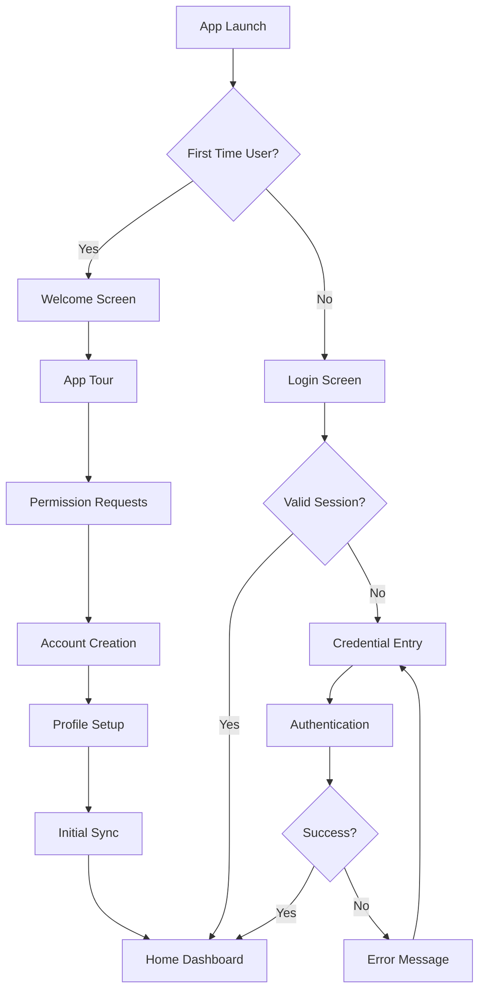

**Key Steps:**
1. **App Launch** - Application initialization and loading
2. **Session Check** - Verify existing authentication
3. **Onboarding** - New user welcome and setup
4. **Authentication** - Login process for returning users
5. **Dashboard Access** - Navigate to main application interface

### 2. Complete Journey Planning Flow

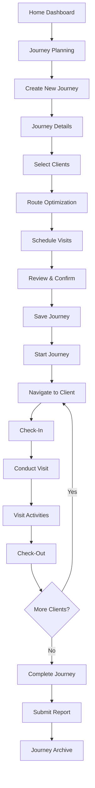

**Visit Activities Detail:**
```mermaid
graph LR
    A[Visit Start] --> B[Client Greeting]
    B --> C[Needs Assessment]
    C --> D[Product Presentation]
    D --> E[Order Discussion]
    E --> F[Issue Resolution]
    F --> G[Follow-up Planning]
    G --> H[Visit Summary]
    H --> I[Action Items]
    I --> J[Next Appointment]
    J --> K[Visit Complete]
```

### 3. Client Management Workflow

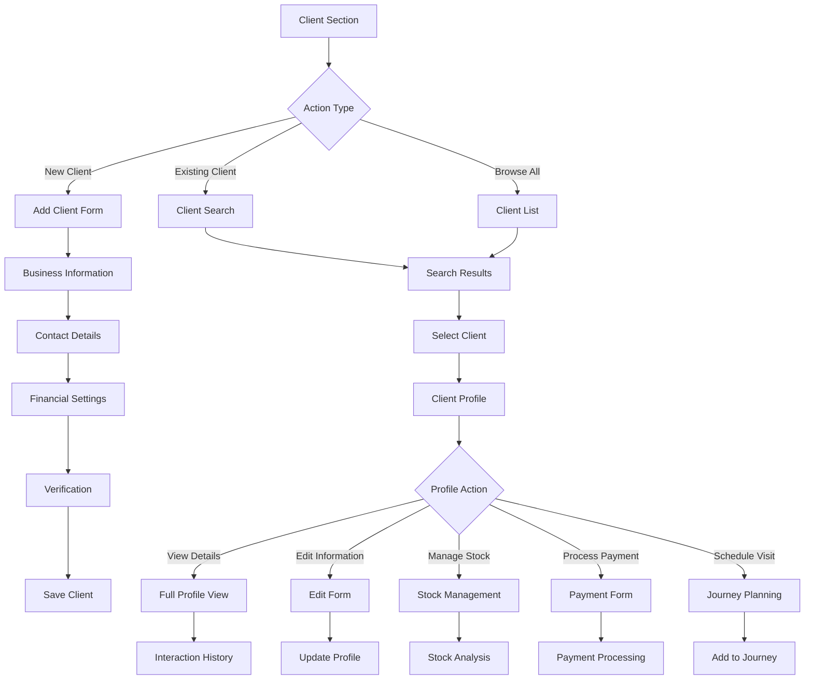

### 4. Order Management Complete Flow

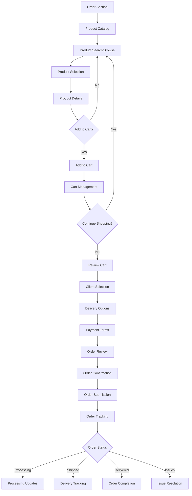

**Cart Management Detail:**
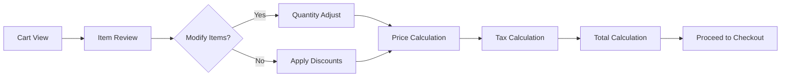

### 5. POS System Transaction Flow

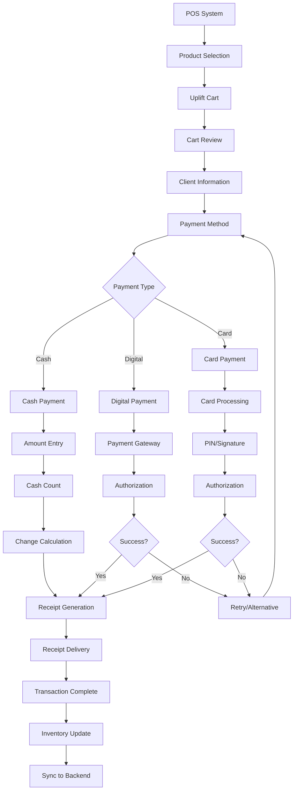

### 6. Task Management Flow

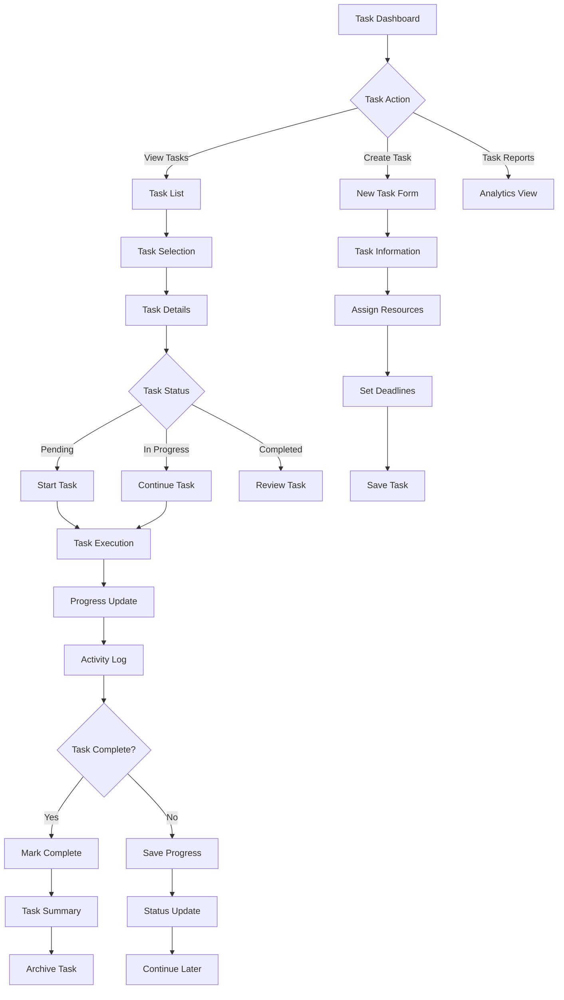

### 7. Profile and Settings Management

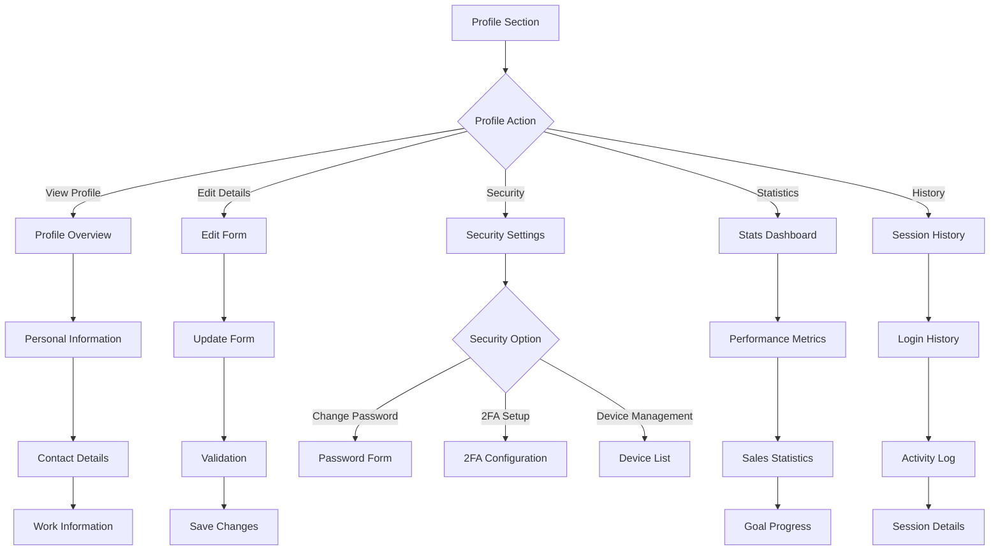

### 8. Offline to Online Synchronization Flow

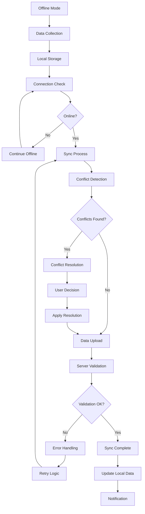

## 📱 Platform-Specific Flows

### Mobile Application Flows

#### Android Navigation Pattern
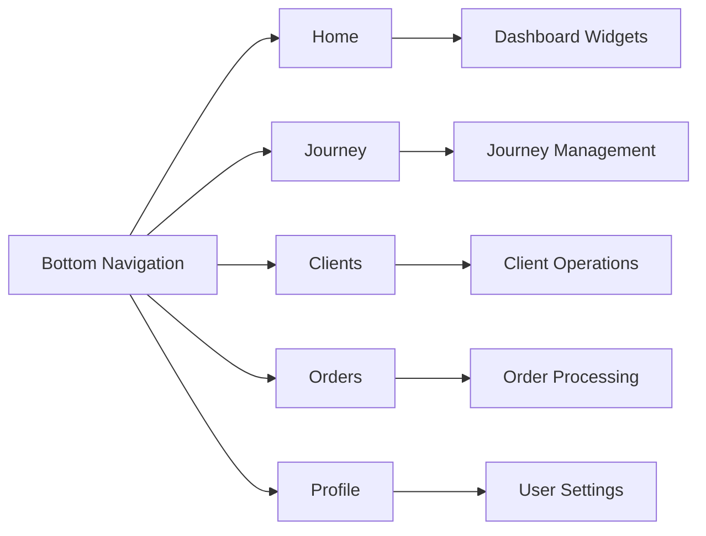

#### iOS Navigation Pattern
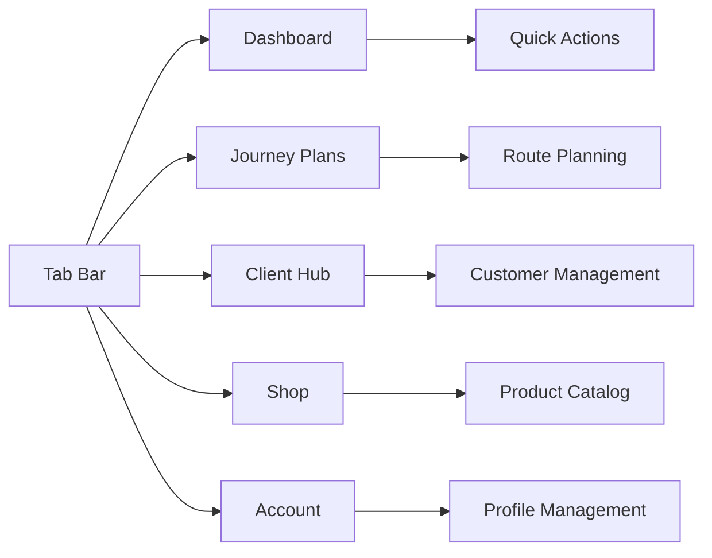

### Web Application Flows

#### Desktop Navigation
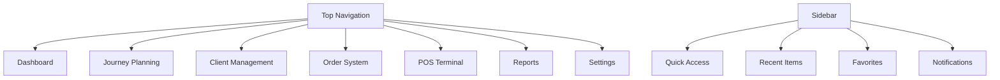

## 🎯 Error Handling Flows

### Connection Error Recovery
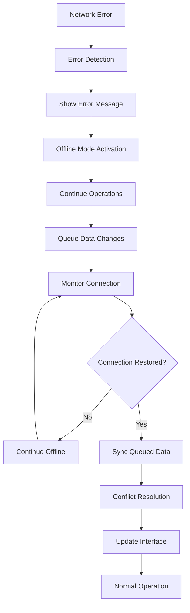

### Data Validation Error Flow
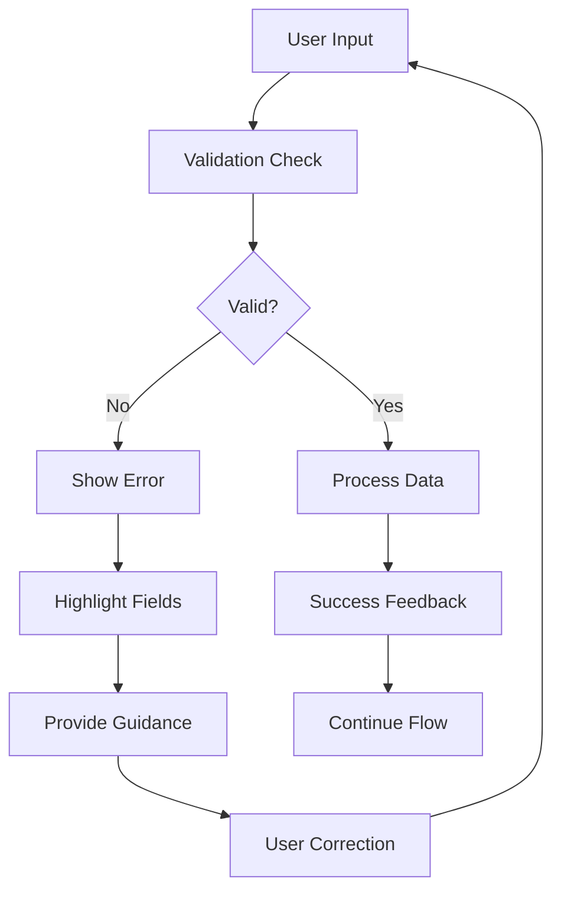

## 🔄 Accessibility Flows

### Screen Reader Navigation
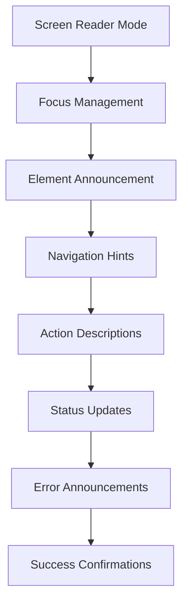

### Keyboard Navigation
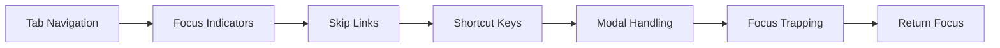

## 🎨 UI State Flows

### Loading States
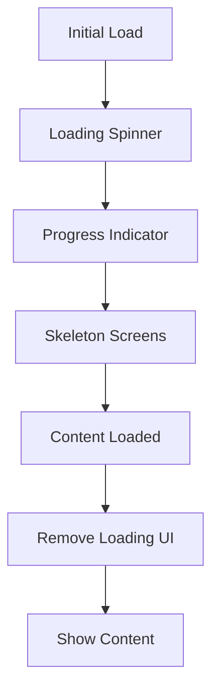

### Empty States
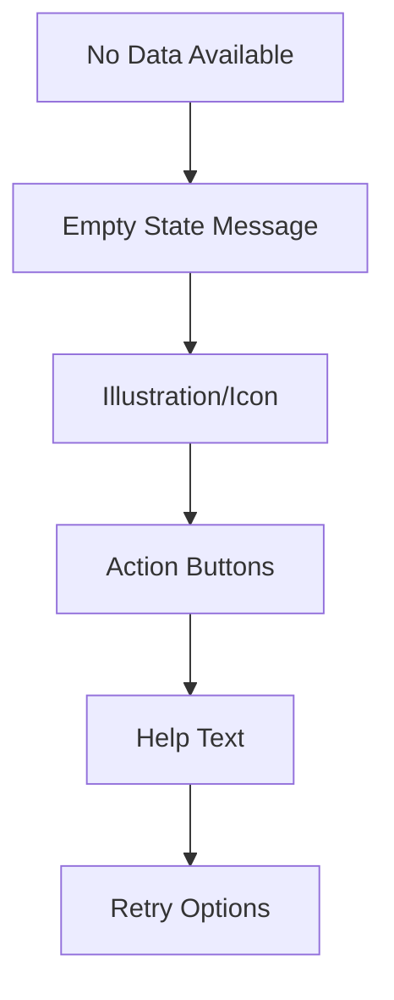

## 📊 Analytics and Tracking Flows

### User Behavior Tracking
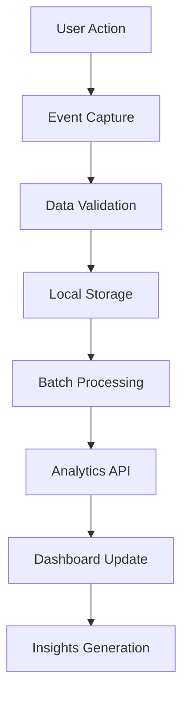

### Performance Monitoring
```mermaid
graph TD
    A[App Performance] --> B[Metrics Collection]
    B --> C[Performance Analysis]
    C --> D[Issue Detection]
    D --> E[Alert Generation]
    E --> F[Optimization]
    F --> G[Performance Improvement]
```

## 🔐 Security Flows

### Authentication Security
```mermaid
graph TD
    A[Login Attempt] --> B[Rate Limiting]
    B --> C[Credential Validation]
    C --> D[Security Checks]
    D --> E[Multi-factor Auth]
    E --> F[Session Creation]
    F --> G[Security Monitoring]
    G --> H[Access Granted]
```

### Data Security
```mermaid
graph TD
    A[Sensitive Data] --> B[Encryption]
    B --> C[Secure Storage]
    C --> D[Access Control]
    D --> E[Audit Logging]
    E --> F[Regular Cleanup]
    F --> G[Compliance Check]
```

## 🎯 Optimization Flows

### Performance Optimization
```mermaid
graph TD
    A[App Launch] --> B[Critical Path Load]
    B --> C[Background Loading]
    C --> D[Resource Optimization]
    D --> E[Caching Strategy]
    E --> F[Lazy Loading]
    F --> G[Performance Monitoring]
```

### User Experience Optimization
```mermaid
graph TD
    A[User Journey] --> B[Experience Tracking]
    B --> C[Pain Point Analysis]
    C --> D[UX Improvements]
    D --> E[A/B Testing]
    E --> F[Feedback Collection]
    F --> G[Iterative Enhancement]
```

## 📞 Support and Help Flows

### In-App Help System
```mermaid
graph TD
    A[Help Request] --> B[Context Detection]
    B --> C[Relevant Help Content]
    C --> D[Interactive Tutorials]
    D --> E[FAQ Search]
    E --> F[Contact Support]
    F --> G[Issue Resolution]
```

### Error Reporting Flow
```mermaid
graph TD
    A[Error Occurrence] --> B[Error Capture]
    B --> C[User Notification]
    C --> D[Report Generation]
    D --> E[User Feedback]
    E --> F[Support Ticket]
    F --> G[Resolution Tracking]
```

---

**Navigation Guide:**
- 🏠 **Home Dashboard** - Central hub for all operations
- 🗺️ **Journey Planning** - Route optimization and visit management
- 👥 **Client Management** - Customer relationship management
- 📦 **Order Management** - Product ordering and inventory
- 💰 **POS System** - Point of sale transactions
- 📋 **Task Management** - Task assignment and tracking
- 👤 **Profile Management** - User settings and preferences
- 📊 **Reports & Analytics** - Performance insights and reporting

**Last Updated**: December 2024  
**Version**: 1.0.7+1  
**Applies to**: All platforms (Android, iOS, Web, Desktop)