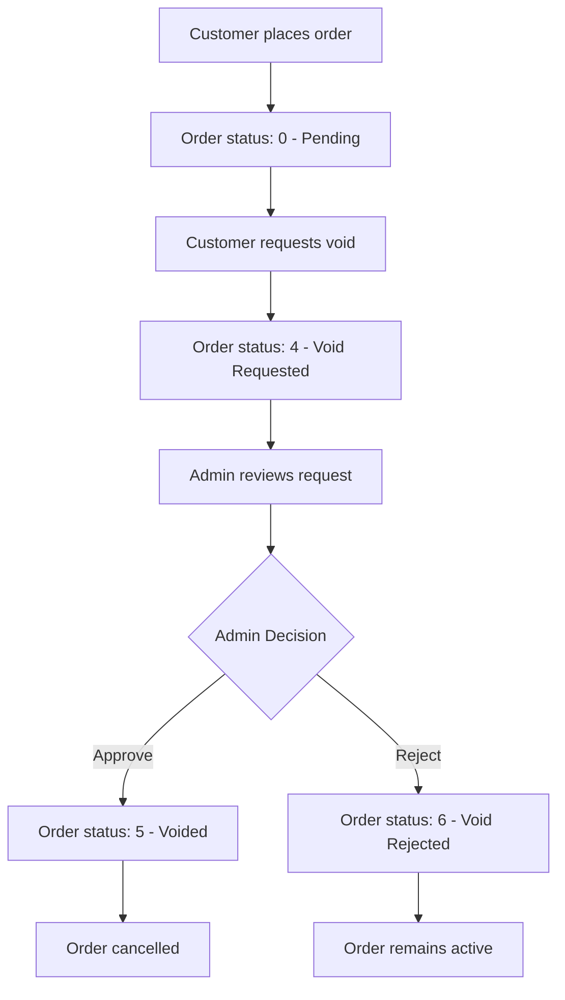

# Order Void Process Documentation

## Overview
The order void process allows customers to request cancellation of their pending orders. Only pending orders (status 0) can be voided, and the request must be approved by an administrator.

## Status Codes
| Code | Status | Description |
|------|--------|-------------|
| 0 | Pending | Active order that can be voided |
| 4 | Void Requested | Customer has requested void, waiting for admin approval |
| 5 | Voided | Admin approved the void request |
| 6 | Void Rejected | Admin rejected the void request |

## User Endpoints

### 1. Request Order Void
**Endpoint:** `POST /api/orders/:orderId/void-request`

**Description:** Submit a void request for a pending order.

**Authentication:** Required (JWT token)

**Request Body:**
```json
{
  "reason": "Wrong items ordered" // Optional
}
```

**Response:**
```json
{
  "success": true,
  "message": "Void request submitted",
  "orderId": 123
}
```

**Error Responses:**
- `404`: Order not found or not pending
- `500`: Server error

**Validation Rules:**
- Order must belong to the authenticated user
- Order status must be 0 (Pending)
- Order must exist in the database

### 2. Check Void Status
**Endpoint:** `GET /api/orders/:orderId/void-status`

**Description:** Check the current status of a void request.

**Authentication:** Required (JWT token)

**Response:**
```json
{
  "success": true,
  "orderId": 123,
  "status": 4,
  "statusMessage": "Void Requested",
  "canRequestVoid": false,
  "reason": "Wrong items ordered"
}
```

**Status Messages:**
- `Pending`: Order is active and can be voided
- `Void Requested`: Void request is pending admin approval
- `Voided`: Admin approved the void request
- `Void Rejected`: Admin rejected the void request
- `Unknown Status`: Order has an unrecognized status

## Process Flow



## Database Schema
Uses existing `MyOrder` table with the following fields:
- `id`: Order ID
- `status`: Order status (0, 4, 5, 6)
- `cancel_reason`: Reason for void request
- `userId`: Customer who placed the order

## Implementation Details

### Controller Functions
1. **`requestOrderVoid`**: Handles void request submission
2. **`checkVoidStatus`**: Returns current void status

### Security Features
- User can only void their own orders
- Authentication required for all endpoints
- Status validation prevents invalid requests
- Proper error handling and logging

### Error Handling
- Invalid order ID
- Unauthorized access
- Invalid order status
- Database connection errors
- Server errors

## Usage Examples

### Request a Void
```bash
curl -X POST \
  http://localhost:3000/api/orders/123/void-request \
  -H 'Authorization: Bearer YOUR_JWT_TOKEN' \
  -H 'Content-Type: application/json' \
  -d '{
    "reason": "Changed my mind"
  }'
```

### Check Status
```bash
curl -X GET \
  http://localhost:3000/api/orders/123/void-status \
  -H 'Authorization: Bearer YOUR_JWT_TOKEN'
```

## Admin Process (Separate Implementation)
The admin approval process is handled separately and includes:
- View all pending void requests
- Approve or reject requests
- Update order status accordingly
- Notify customers of decisions

## Notes
- Only pending orders (status 0) can be voided
- Void requests are stored in the existing `cancel_reason` field
- The process maintains data integrity through proper validation
- All operations are logged for audit purposes
- The system prevents multiple void requests for the same order 